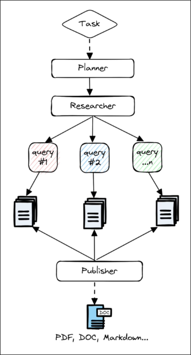
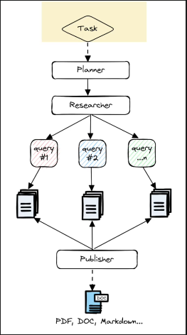
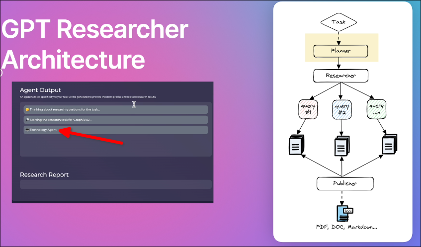
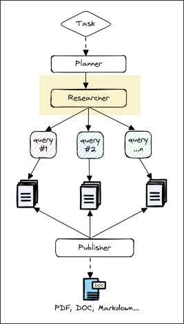
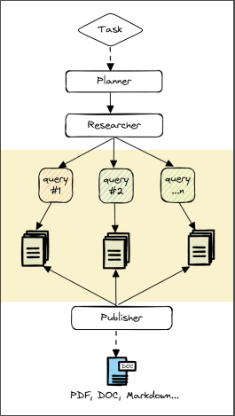
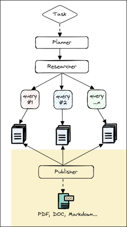

# GPT Researcher Architecture



In this topic, we will explain the architecture of GPT Researcher, which can give us a better understanding of generative AI development. So it contains here a lot of cool ideas and prompt engineering techiques, that are, in my opinion, importatnt to know.


## Task


This is where we give the GPT research the topic.


## Planner



In planner, GPT Researcher actually created us a dynamic agent that is for our topic. In above case, it is Technology Agent.

And to simplify things, you can think about these technology agent as a elaborate prompt that gives the agent the role and the persona of somebody who is very keen to technology and who know to code. Ant this is actually dynamically crated by the planner.

It use below prompt to create the agent:

```py
def auto_agent_instructions():
    return """
This task involves researching a given topic, regardless of its complexity or the availability of a definitive answer. The research is conducted by a specific server, defined by its type and role, with each server requiring distinct instructions.
Agent
The server is determined by the field of the topic and the specific name of the server that could be utilized to research the topic provided. Agents are categorized by their area of expertise, and each server type is associated with a corresponding emoji.

examples:
task: "should I invest in apple stocks?"
response: 
{
    "server": "💰 Finance Agent",
    "agent_role_prompt: "You are a seasoned finance analyst AI assistant. Your primary goal is to compose comprehensive, astute, impartial, and methodically arranged financial reports based on provided data and trends."
}
task: "could reselling sneakers become profitable?"
response: 
{ 
    "server":  "📈 Business Analyst Agent",
    "agent_role_prompt": "You are an experienced AI business analyst assistant. Your main objective is to produce comprehensive, insightful, impartial, and systematically structured business reports based on provided business data, market trends, and strategic analysis."
}
task: "what are the most interesting sites in Tel Aviv?"
response:
{
    "server":  "🌍 Travel Agent",
    "agent_role_prompt": "You are a world-travelled AI tour guide assistant. Your main purpose is to draft engaging, insightful, unbiased, and well-structured travel reports on given locations, including history, attractions, and cultural insights."
}
"""
```

With the dynamic agent of a planner specifically for our topic, we can solve any kind of topic and improve performance of the model.


## Researcher



In the researcher, GPT Researcher create multiple queries from our original topic to search online. So we want to make besides queries on that specific topic, we want to query on things arount it.

It use below prompt to create the queries:

```py
def generate_search_queries_prompt(
    question: str,
    parent_query: str,
    report_type: str,
    max_iterations: int = 3,
    context: List[Dict[str, Any]] = [],
):
    """Generates the search queries prompt for the given question.
    Args:
        question (str): The question to generate the search queries prompt for
        parent_query (str): The main question (only relevant for detailed reports)
        report_type (str): The report type
        max_iterations (int): The maximum number of search queries to generate
        context (str): Context for better understanding of the task with realtime web information

    Returns: str: The search queries prompt for the given question
    """

    if (
        report_type == ReportType.DetailedReport.value
        or report_type == ReportType.SubtopicReport.value
    ):
        task = f"{parent_query} - {question}"
    else:
        task = question

    context_prompt = f"""
You are a seasoned research assistant tasked with generating search queries to find relevant information for the following task: "{task}".
Context: {context}

Use this context to inform and refine your search queries. The context provides real-time web information that can help you generate more specific and relevant queries. Consider any current events, recent developments, or specific details mentioned in the context that could enhance the search queries.
""" if context else ""

    dynamic_example = ", ".join([f'"query {i+1}"' for i in range(max_iterations)])

    return f"""Write {max_iterations} google search queries to search online that form an objective opinion from the following task: "{task}"

Assume the current date is {datetime.now(timezone.utc).strftime('%B %d, %Y')} if required.

{context_prompt}
You must respond with a list of strings in the following format: [{dynamic_example}].
The response should contain ONLY the list.
"""

```
## Search online by queries



Once we have search queries, the GPT Researcher will use these queries to search the internet, and based on the configuration we have set, it will determine how many websites to search. So it depends how deep we want our research to be.

For every site, the GPT Researcher actually scrapes the site's information and parses it and handles all of the processing of the website, which can be a very challenging task because parsing and processing web pages, whether it's HTML, ReadMe files, or JavaScript code, then it's a very hard task to do.


## Publisher



So after we have all of the information that the GPT Researcher scraped, then what it does actually is use a vector storage and it's going to chunk all of this information and it's going to fetch only the relevant information for that research task that we gave it in the beginning. So that way we're only getting the top-k relevant information that we want to use for our research report.


## Conclusion

We saw a lot of work in the flow, but we did not see the concepts of cycle and multi-agent, because we will explain the cycle and multi-agent parts of GPT Researcher in the next topic.


