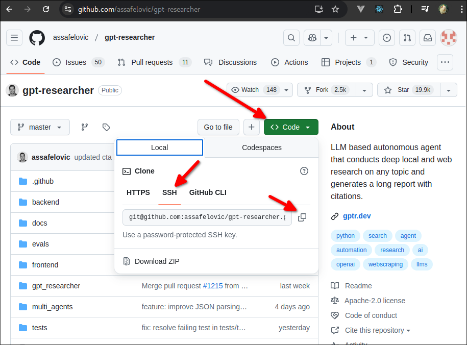

# GPT Researcher Setup

> NOTE: You must have GPT API KEY and TAVILY API KEY in the environment variables in order to run GPT Researcher. If you do not have them, please add them to the .env file yourself.



```sh
 git clone git@github.com:assafelovic/gpt-researcher.git
 cd gpt-researcher/
 python -m venv .venv
 source .venv/bin/activate.fish
 pip install -r requirements.txt
 python -m uvicorn main:app --reload
# INFO:     Will watch for changes in these directories: ['/home/matt/Github/gpt-researcher']
# INFO:     Uvicorn running on http://127.0.0.1:8000 (Press CTRL+C to quit)
# INFO:     Started reloader process [12087] using StatReload
# INFO:     Started server process [12089]
# INFO:     Waiting for application startup.
# INFO:     Application startup complete.
# INFO:     127.0.0.1:34278 - "GET / HTTP/1.1" 200 OK
# INFO:     127.0.0.1:34278 - "GET /site/styles.css HTTP/1.1" 200 OK
# INFO:     127.0.0.1:34284 - "GET /site/scripts.js HTTP/1.1" 200 OK
# INFO:     127.0.0.1:34284 - "GET /static/gptr-logo.png HTTP/1.1" 200 OK
# INFO:     127.0.0.1:34284 - "GET /static/favicon.ico HTTP/1.1" 200 OK

```


