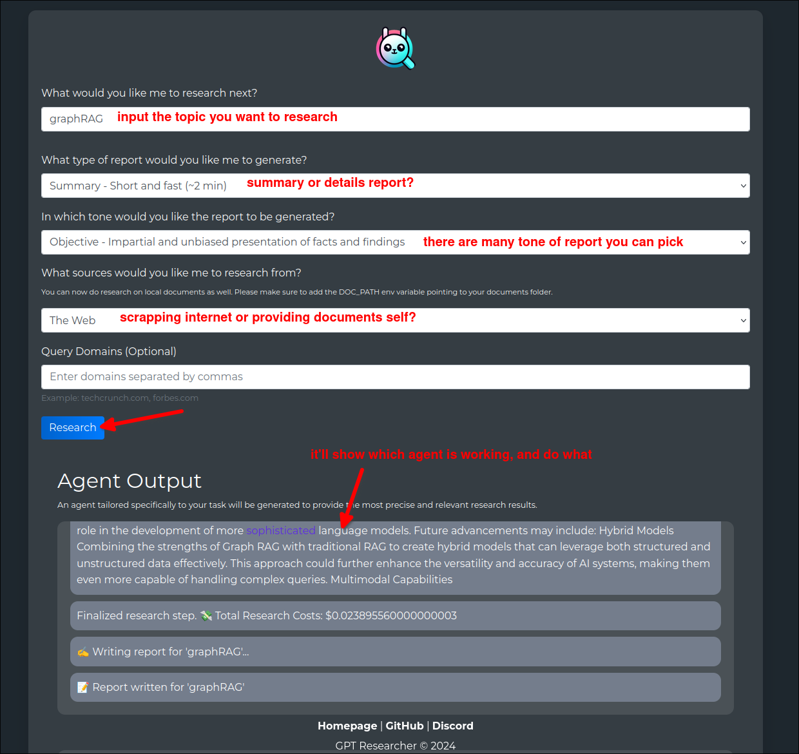
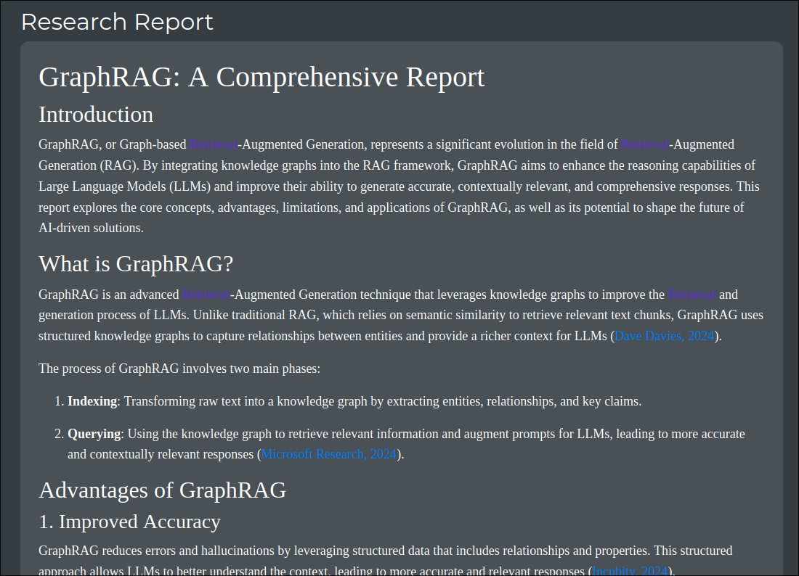

# GPT Researcher

## Introduction

This is a production-level project based on GPT, used to allow users to provide a research topic, and then generate a research report through it.

It is scalable, doable, cost efficient and yields very high quality ouptuts,these points are the reasons that make it suitable as a production-level project.

## Demo to generate a research report

Under the report, there are also many buttons provided to download the file in different formats, such as .pdf, .docx, .md.

## Some issues

If the Chinese topic is given, an error exceeding the token rate limit will occur at the end, resulting in the report being unable to generate.

