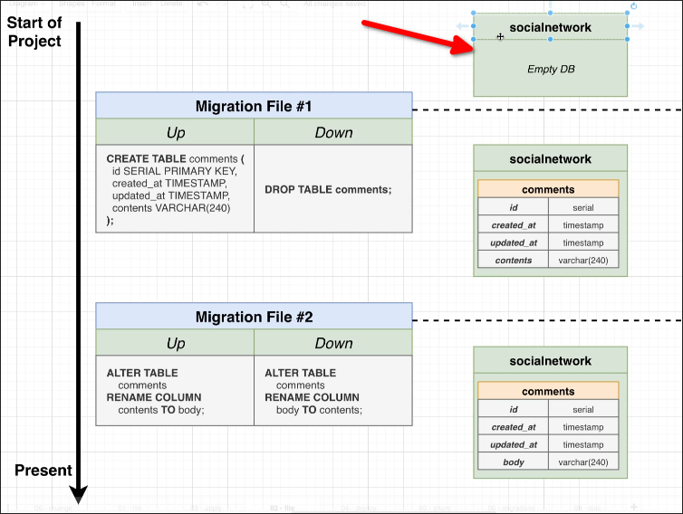

# Generating and Writing Migrations



```sh
 psql -U postgres
psql (17.2)
Type "help" for help.

postgres=# CREATE DATABASE socialnetwork;
CREATE DATABASE

```


File: /home/matt/Projects/ig/package.json
```json
{
  "name": "ig",
  "version": "1.0.0",
  "description": "",
  "main": "index.js",
  "scripts": {
    "migrate": "node-pg-migrate" <--- Add this line, it let us can run the `node-pg-migrate` in the terminal cli
  },
  "keywords": [],
  "author": "",
  "license": "ISC",
  "type": "commonjs",
  "dependencies": {
    "node-pg-migrate": "^7.9.1",
    "pg": "^8.13.3"
  }
}
```

```sh
 npm run migrate create table comments
#                        ^^^^^^^^^^^^^^ it'll create a migration file with name `[timestamp]_table-comments.js`
> ig@1.0.0 migrate
> node-pg-migrate create table comments

Created migration -- /home/matt/Projects/ig/migrations/1741411109659_table-comments.js
```

File: /home/matt/Projects/ig/migrations/1741411109659_table-comments.js
```javascript
/**
 * @type {import('node-pg-migrate').ColumnDefinitions | undefined}
 */
exports.shorthands = undefined;

/**
 * @param pgm {import('node-pg-migrate').MigrationBuilder}
 * @param run {() => void | undefined}
 * @returns {Promise<void> | void}
 */
exports.up = (pgm) => {}; // write up part of the migration here
//            ^^^ this is an object that provides lots of methods to create tables, columns, indexes, etc.
//                but we only need to use the `pgm.sql()` method to write the raw SQL script

/**
 * @param pgm {import('node-pg-migrate').MigrationBuilder}
 * @param run {() => void | undefined}
 * @returns {Promise<void> | void}
 */
exports.down = (pgm) => {}; // write down part of the migration here
```


Let's write the `up` and `down` part of the migration file

```js
/**
 * @type {import('node-pg-migrate').ColumnDefinitions | undefined}
 */
exports.shorthands = undefined;

/**
 * @param pgm {import('node-pg-migrate').MigrationBuilder}
 * @param run {() => void | undefined}
 * @returns {Promise<void> | void}
 */
exports.up = (pgm) => {
  // wirte the raw SQL script to create the `comments` table in the pgm.sql() method
  pgm.sql(`
    CREATE TABLE comments (
      id SERIAL PRIMARY KEY,
      created_at TIMESTAMP WITH TIME ZONE DEFAULT CURRENT_TIMESTAMP,
      updated_at TIMESTAMP WITH TIME ZONE DEFAULT CURRENT_TIMESTAMP,
      contents VARCHAR(240) NOT NULL
    );
  `)
};

/**
 * @param pgm {import('node-pg-migrate').MigrationBuilder}
 * @param run {() => void | undefined}
 * @returns {Promise<void> | void}
 */
exports.down = (pgm) => {
  // wirte the raw SQL script to drop the `comments` table in the pgm.sql() method,
  // which removes the impact of the `up` part of the migration entirely
  pgm.sql(`
    DROP TABLE comments;
  `)
};

```

The next topic we will learn how to apply this migration file to our database.


