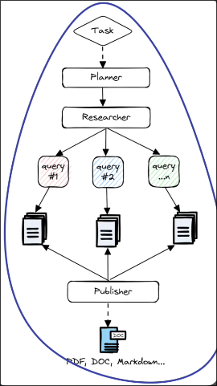
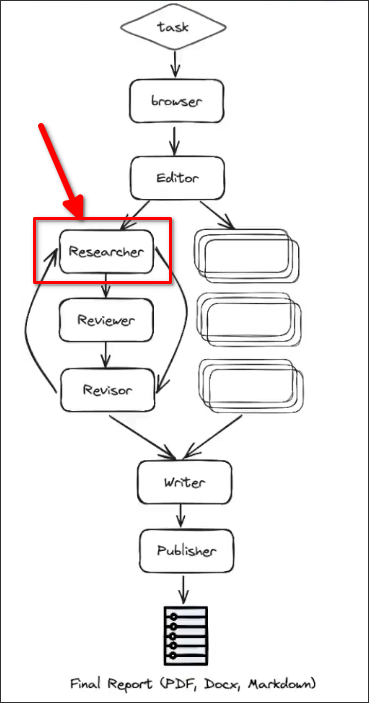
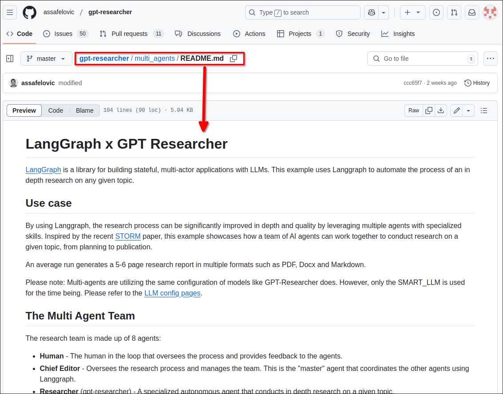
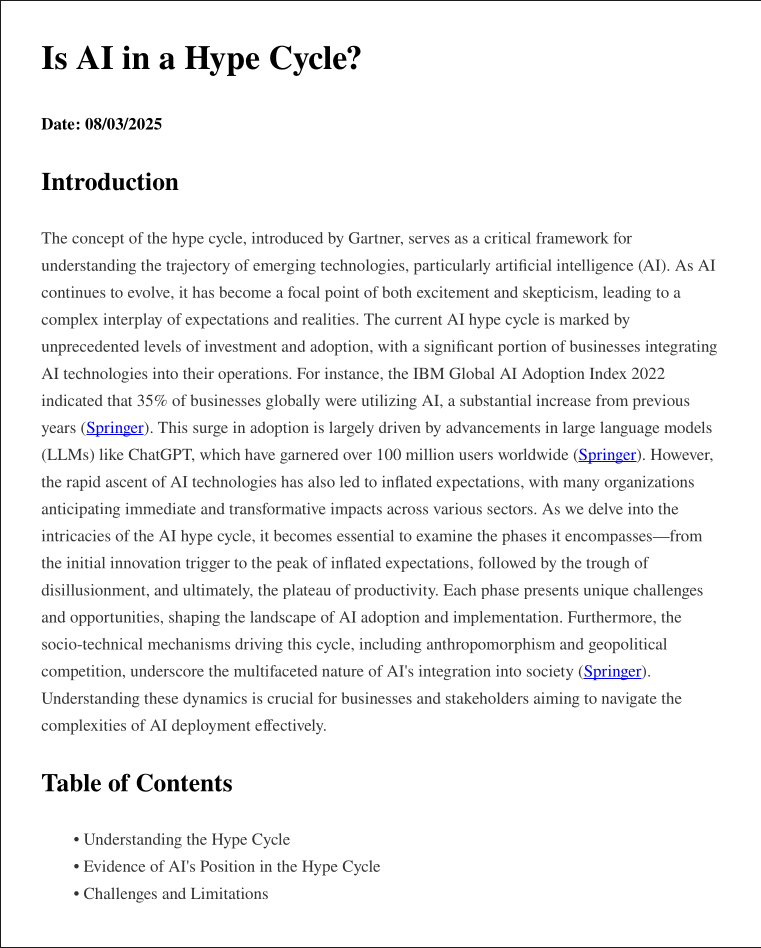
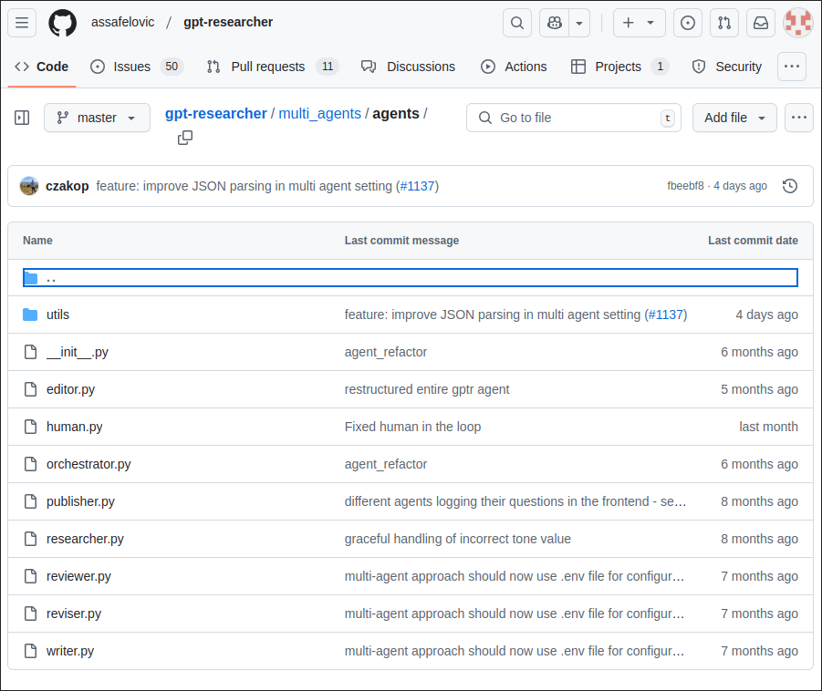
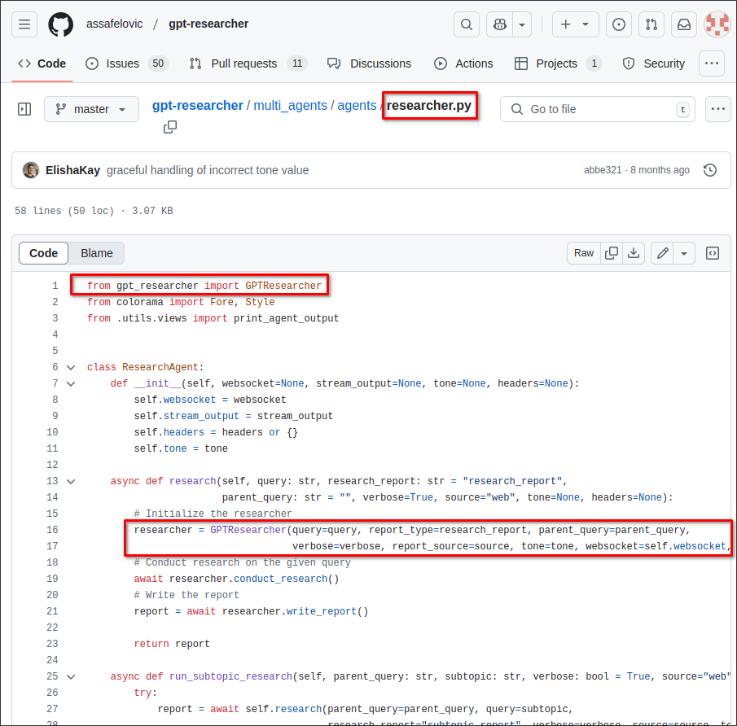

# Multi Agent Architecture

In this topic, we want to treat the entire GPT Research system from the previous topic as a single node, and insert it into the LangGraph multi-agent system.






In the diagram above, we can see the entire GPT Research system being inserted as a node into the LangGraph multi-agent system. The Reviewer node behind it will check the output of the GPT Research system and provide critique feedback, which will then be used by the Revisor node to correct the output of the GPT Research system. Finally, it will go back to the Researcher node to form a cycle.

We can go to the *multi_agents* folder in the gpt-research repository to see the README file for more details on how to implement this multi-agent architecture.




We want to create another environment for it, and edit the file `task.json` to change the question:

```sh
python -m venv .venv
source .venv/bin/activate.fish
pip install -r requirements.txt
```


File: /home/matt/Github/gpt-researcher/multi_agents/task.json
```json
{
  "query": "Is AI in a hype cycle?", <-- Change to the question you want to ask
  "max_sections": 3,
  "publish_formats": {
    "markdown": true,
    "pdf": true,
    "docx": true
  },
  "include_human_feedback": false,
  "follow_guidelines": false, <--- should be true if you want to follow the guidelines (I just forgot to change it ._.)
  "model": "gpt-4o-mini", <-- I replace `gpt-4o` with `gpt-4o-mini` to make it faster ._.
  "guidelines": [
    "The report MUST be written in APA format",
    "Each sub section MUST include supporting sources using hyperlinks. If none exist, erase the sub section or rewrite it to be a part of the previous section",
    "The report MUST be written in traditional Chinese" <--- It's Spanish at first, I change it to Chinese ._.
  ],
  "verbose": true
}
```

Then we can run the following command to let this multi-agent system generate the report:

```sh
python main.py

# ...
# ...
# PUBLISHER: Publishing final research report based on retrieved data...
# Report written to ./outputs/run_1741407403_Is AI in a hype cycle_/1afb137cfe024de2baee0b0f5b248a12.pdf
# Report written to ./outputs/run_1741407403_Is AI in a hype cycle_/7c2259c3b5c14f1797384dd3a6365ad2.docx
# Report written to ./outputs/run_1741407403_Is AI in a hype cycle_/c72fa313640e44539324e2038099538f.md
```

It generate a report in PDF, DOCX, and Markdown format. We check the PDF file:




The above is the content of one of the pages, there are a total of 12 pages. Due to the presence of reviewer and revisor nodes, the quality of the report is better than that of only a GPT Researcher's report.


Let's check some files in the multi_agents folder:



The multi_agents/agents folder is specifically for writing agents. You can see many familiar agents, such as reviewer, revisor, and some new agents.



You can find GPT Researcher used as an SDK above, so we can directly install it using `pip install`, and use it in our multi-agent system as mentioned above. It will handle the entire process of GPT Researcher from providing the topic to generating the final report.


