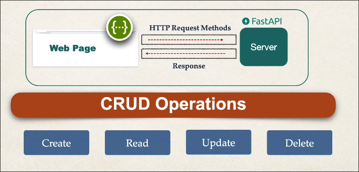
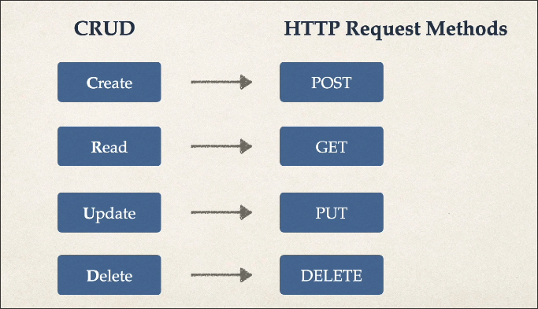

# Books Project Introduction

This project uses a simple list of dictionaries to simulate a book database. We will implement simple endpoints for CRUD operations in this project.

```python
from fastapi import FastAPI


app = FastAPI()

BOOKS = [
    {"title": "Harry Potter", "author": "J.K. Rowling", "category": "fantasy"},
    {"title": "Harry Potter 2", "author": "J.K. Rowling", "category": "fantasy"},
    {"title": "The Lord of the Rings", "author": "J.R.R. Tolkien", "category": "fantasy"},
    {"title": "The Lord of the Rings 2", "author": "J.R.R. Tolkien", "category": "fantasy"},
    {"title": "The Da Vinci Code", "author": "Dan Brown", "category": "thriller"},
    {"title": "The Da Vinci Code 2", "author": "Dan Brown", "category": "thriller"},
    {"title": "The Alchemist", "author": "Paulo Coelho", "category": "adventure"},
    {"title": "The Alchemist 2", "author": "Paulo Coelho", "category": "adventure"},
]
```

And we'll create API endpoints to perform CRUD operations on this list. And the client can interact with these API through HTTP requests with the specified methods.






