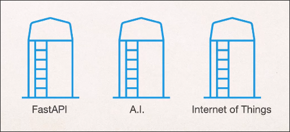

# Virtual Environment for Python project



In Python, we don't need to install all dependencies at once, instead we can create a virtual environment for each project and install the necessary dependencies within it.


Python itself can use the `venv` module to create virtual environments.

```sh
 mkdir fastapi # create a directory for the project
 cd fastapi/
 python -m venv fastapienv # create a virtual environment named `fastapienv`
#        ^^^^^^^ means use the `venv` module
 ls
fastapienv/  # it creates a directory named `fastapienv` for the virtual environment
 pip list # to check the installed packages
Package                   Version
------------------------- ----------------
anyio                     4.8.0
attrs                     23.2.1.dev0
Brlapi                    0.8.6
btrfsutil                 6.13
build                     1.2.2
CacheControl              0.14.2
cachy                     0.3.0
certifi                   2025.1.31
cffi                      1.17.1
charset-normalizer        3.4.1
...
...
...
tomlkit                   0.13.2
tqdm                      4.67.1
trove-classifiers         2025.2.18.16
typing_extensions         4.12.2
urllib3                   2.3.0
virtualenv                20.28.0
virtualenv-clone          0.5.7
webencodings              0.5.1
wheel                     0.45.0 # still a lot of packages are installed because we are in the global environment

 source fastapienv/bin/activate.fish # activate the virtual environment we created
 pip list
Package Version
------- -------
pip     24.3.1  # only `pip` is installed in the virtual environment

 pip install fastapi # install the `fastapi` package
 pip install "uvicorn[standard]"  # install the `uvicorn` package with the `standard` extras
 pip list
Package           Version
----------------- --------
annotated-types   0.7.0
anyio             4.8.0
click             8.1.8
fastapi           0.115.11
h11               0.14.0
httptools         0.6.4
idna              3.10
pip               24.3.1
pydantic          2.10.6
pydantic_core     2.27.2
python-dotenv     1.0.1
PyYAML            6.0.2
sniffio           1.3.1
starlette         0.46.1
typing_extensions 4.12.2
uvicorn           0.34.0
uvloop            0.21.0
watchfiles        1.0.4
websockets        15.0.1  # now only the packages we installed are listed (some packages are installed as dependencies of the packages we installed)
```


