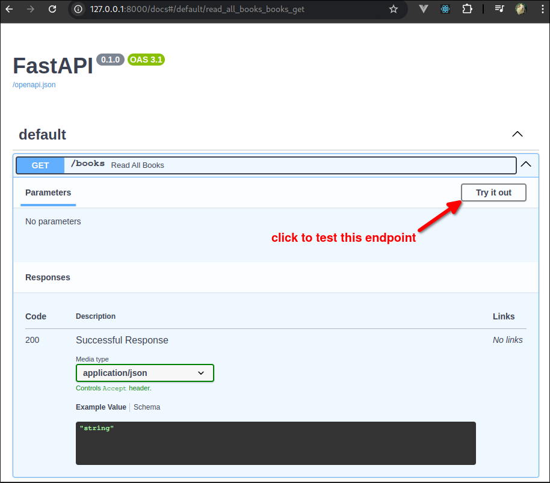
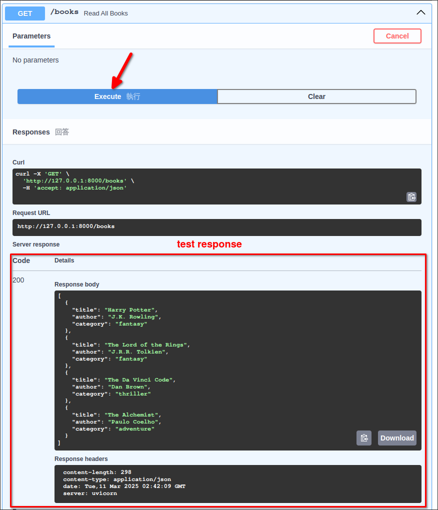

# Swagger UI

FastAPI provides a built-in Swagger UI that allows you to test your API endpoints directly from your browser. And it's not just for testing, it also provides the detils of the API endpoints, request and response formats, and more.

When the FastAPI server is running, you can access the Swagger UI by navigating to `http://[your_server_ip]:[port]/docs`. For example, if your server is running on `localhost` and port `8000`, you can access the Swagger UI by navigating to `http://localhost:8000/docs`.

