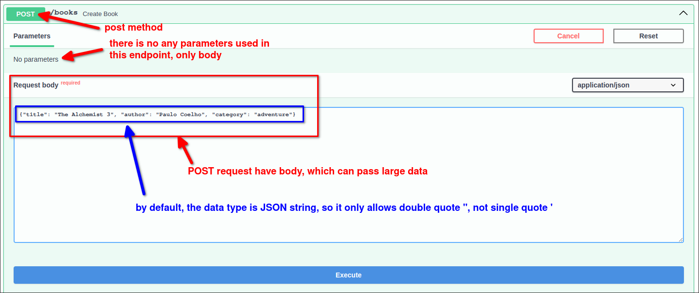

# Book project: endpoint to create data with the body

## Scenario

Data:

```py
BOOKS = [
    {"title": "Harry Potter", "author": "J.K. Rowling", "category": "fantasy"},
    {"title": "Harry Potter 2", "author": "J.K. Rowling", "category": "fantasy"},
    {"title": "The Lord of the Rings", "author": "J.R.R. Tolkien", "category": "fantasy"},
    {"title": "The Lord of the Rings 2", "author": "J.R.R. Tolkien", "category": "fantasy"},
    {"title": "The Da Vinci Code", "author": "Dan Brown", "category": "thriller"},
    {"title": "The Da Vinci Code 2", "author": "Dan Brown", "category": "thriller"},
    {"title": "The Alchemist", "author": "Paulo Coelho", "category": "adventure"},
    {"title": "The Alchemist 2", "author": "Paulo Coelho", "category": "adventure"},
]
```

We need an endpoint that allows the client to create new book data through an HTTP request.


## Analysis

We usually use the *POST method* to create data, because this method allows us to send larger data in the *request body* to the server side.


## Implementation

```py
from fastapi import Body, FastAPI

app = FastAPI()

@app.post("/books")
#    ^^^^  ^^^^^^ it's convention that the endpoint path only contains the resource name, not the action
#    ^^^^ means that this endpoint will accept POST requests, and also implies that it will `create` a new book (action)
def create_book(book=Body()):
#               ^^^^^^^^^^^ accepts the body of the request as the `book` parameter
    # consume the request body and append it to the `BOOKS` list
    BOOKS.append(book)
```

Let's check this endpoint on the Swagger UI:



You can see that the endpoint has a big text area where you can write the JSON data for the book you want to create.


This endpoint is just for creating new data, so it doesn't return any data, which is all right.


