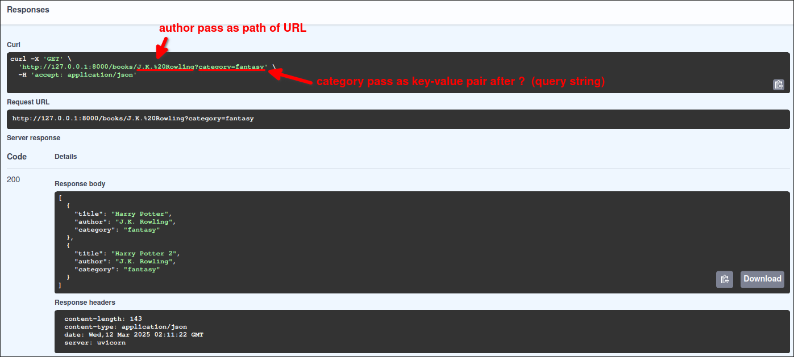

# Book project: endpoint to read data with BOTH Path Parameters and Query Parameters

This example demonstrates how to create a GET endpoint that queries data using both Path Parameters and Query Parameters.

## Scenario

data: 
```py
BOOKS = [
    {"title": "Harry Potter", "author": "J.K. Rowling", "category": "fantasy"},
    {"title": "Harry Potter 2", "author": "J.K. Rowling", "category": "fantasy"},
    {"title": "The Lord of the Rings", "author": "J.R.R. Tolkien", "category": "fantasy"},
    {"title": "The Lord of the Rings 2", "author": "J.R.R. Tolkien", "category": "fantasy"},
    {"title": "The Da Vinci Code", "author": "Dan Brown", "category": "thriller"},
    {"title": "The Da Vinci Code 2", "author": "Dan Brown", "category": "thriller"},
    {"title": "The Alchemist", "author": "Paulo Coelho", "category": "adventure"},
    {"title": "The Alchemist 2", "author": "Paulo Coelho", "category": "adventure"},
]
```

Assuming we want to use Path Parameters to locate books by a specific author, and use Query Parameters to filter books by a specific category.

## Implementation

```py
from fastapi import FastAPI

app = FastAPI()

@app.get("/books/{author}")
#                 ^^^^^^^^ dynamic path from the URL
def read_author_category_by_query(author: str, category: str):
#                                 ^^^^^^^^^^^  ^^^^^^^^^^^^^ not part of the path, so it's a query parameter
#                                 ^^^^^^^^^^^ part of the path, so it's a path parameter

    # use both path and query parameters to filter books
    # (even we say that path parameters are to locate the data, but sometimes they just work as a filter)
    books_to_return = []
    for book in BOOKS:
        author_book = book.get("author")
        category_book = book.get("category")
        if author_book is not None and author_book.casefold() == author.casefold() and category_book is not None and category_book.casefold() == category.casefold():
            books_to_return.append(book)

    return books_to_return

```

Then, we check the endpoint on the Swagger UI:


Swagger UI knows types of parameters from the endpoint definition.



When we execute the test, we can see the swagger passes each parameter to the correct place in the URL.


