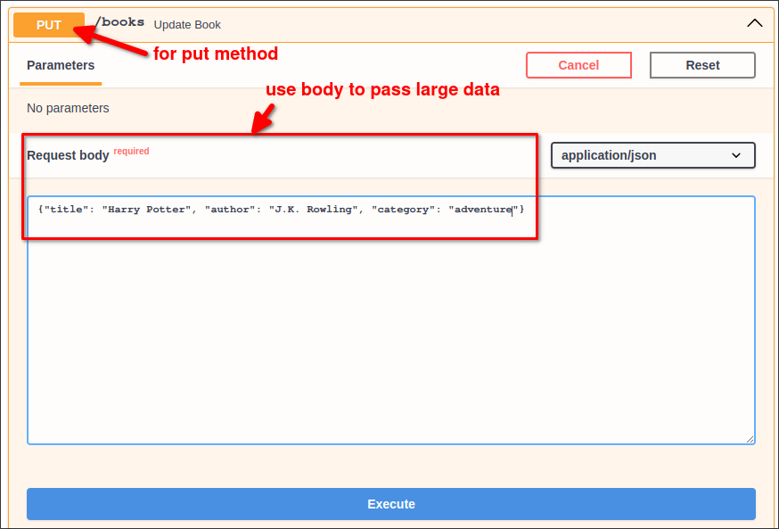
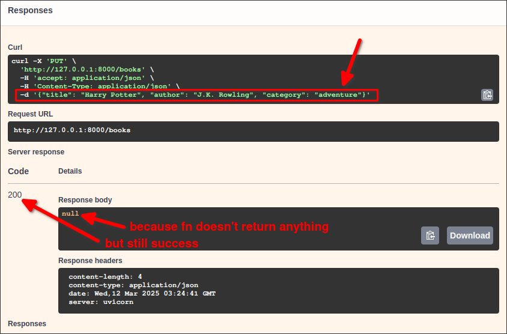

# Endpoint for PUT Request

- Used to *update* data
- PUT can have a *body* that has additional information (like POST) that GET does not have

```py
@app.put("/items")
#   ^^^^  ^^^^^^ in convention, the endpoint is named by the resource it is updating, not the action
#   ^^^^ means that this endpoint is for PUT requests which have body for additional information
def create(item=Body()):
#          ^^^^^^^^^^^ accepts the body of the request and assigns it to the variable `item`
    return item
    #      ^^^^ then, we can consume the body in the function
```

You can find that `PUT` and `POST` are very similar, their main difference will be reflected in the content of the function, POST is used to add data, while PUT is used to update data.

Let's check this endpoint on the Swagger UI:






