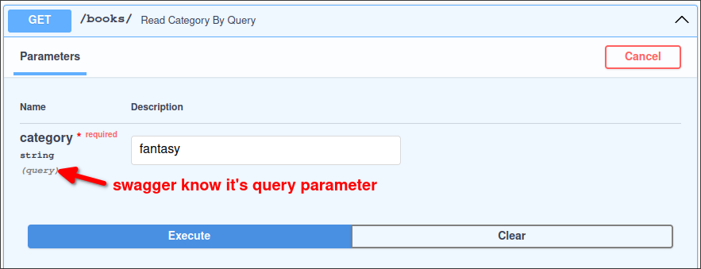
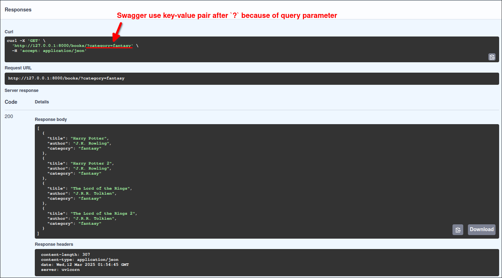

# Example: GET endpoint to filter data by Query Parameters

```py
from fastapi import FastAPI


app = FastAPI()

BOOKS = [
    {"title": "Harry Potter", "author": "J.K. Rowling", "category": "fantasy"},
    {"title": "Harry Potter 2", "author": "J.K. Rowling", "category": "fantasy"},
    {"title": "The Lord of the Rings", "author": "J.R.R. Tolkien", "category": "fantasy"},
    {"title": "The Lord of the Rings 2", "author": "J.R.R. Tolkien", "category": "fantasy"},
    {"title": "The Da Vinci Code", "author": "Dan Brown", "category": "thriller"},
    {"title": "The Da Vinci Code 2", "author": "Dan Brown", "category": "thriller"},
    {"title": "The Alchemist", "author": "Paulo Coelho", "category": "adventure"},
    {"title": "The Alchemist 2", "author": "Paulo Coelho", "category": "adventure"},
]


@app.get("/books/")
def read_category_by_query(category: str):
#                          ^^^^^^^^^^^^^ this is not part of the path, so it's a query parameter

    # use the query parameter to filter the books by category
    books_to_return = []
    for book in BOOKS:
        category_book = book.get("category")
        if category_book is not None and category_book.casefold() == category.casefold():
            books_to_return.append(book)

    return books_to_return

```

If we use Swagger UI to test this API, we can see a parameter named `category`, marked with `(query)` below it, indicating that Swagger UI knows this is a query parameter.



When we test the API, we can see that the query parameter is passed in the URL as key-value pair, after the `?` character.




