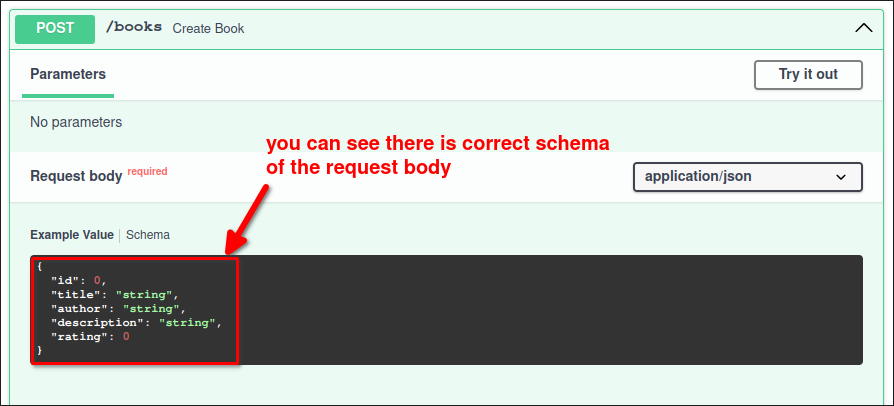

# Books2 project: add request body type validation

We want to add type validation to the request body of the POST /books endpoint.

```py
from fastapi import Body, FastAPI
from pydantic import BaseModel # import


app = FastAPI()

class Book:
    id: int
    title: str
    author: str
    description: str
    rating: int

    def __init__(self, id: int, title: str, author: str, description: str, rating: int):
        self.id = id
        self.title = title
        self.author = author
        self.description = description
        self.rating = rating


# create a request body model which has the same fields as the Book class
class BookRequest(BaseModel):
#                 ^^^^^^^^^ this is pydantic class, inherit it to get lots of functionalities about data validation
    id: int
    title: str
    author: str
    description: str
    rating: int


BOOKS = [ ... ]

@app.get("/books")
def read_all_books():
    return BOOKS

@app.post("/books")
def create_book(book_request: BookRequest):
#                           ^^^^^^^^^^^^^ instead of `=Body()`, change to `: BookRequest`
#                                         it still gets the request body, but it also validates the data by the definition of BookRequest class

    # if we append `book_request` directly, our list has mixed types of Book and BookRequest, that's not good
    # so we need to convert `book_request` to Book instance
    book = Book(**book_request.model_dump())
    #           ^^            ^^^^^^^^^^^^^ convert BookRequest to dict
    #           ^^ unpack the dict to pass as arguments to Book class constructor

    BOOKS.append(book)
    
```

Then, we can check the definition of this endpoint on the Swagger UI again:




