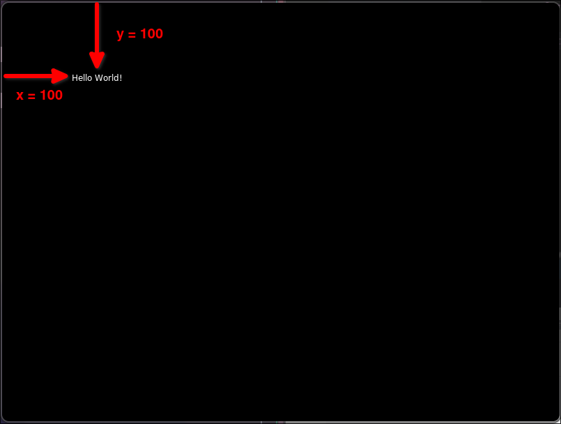
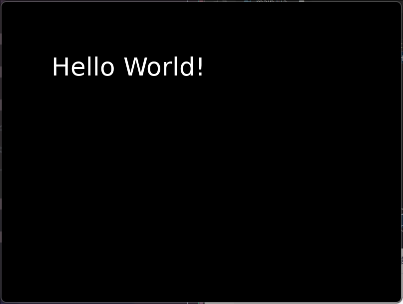

# Draw text

```lua
function love.draw()
  love.graphics.print("Hello World!", 100, 100)
  --                  ^^^^^^^^^^^^^^  ^^^  ^^^ y from top
  --                  ^^^^^^^^^^^^^^  ^^^ x from left
  --                  ^^^^^^^^^^^^^^ text to draw
end
```



We can adjust the font size by calling `love.graphics.setFont(fontSize)` before calling `love.graphics.print()`.

```lua
function love.draw()
  love.graphics.setFont(love.graphics.newFont(50)) -- set font size to 50 before drawing text
  love.graphics.print("Hello World!", 100, 100)
end
```



