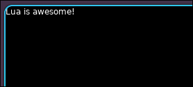
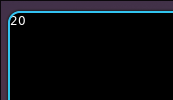
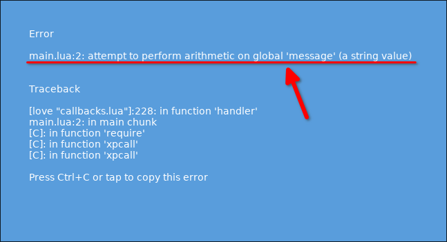

# Variables

Variables are pieces of stored data that can be changed.

```lua
message = "Lua is awesome!" -- defining a variable with a string value

function love.draw()
  love.graphics.print(message)
  --                  ^^^^^^^ using the variable
end
```


We can set multiple variables or even assign a variable to another variable.

```lua
message = "Lua is awesome!"
output = message -- whenever message changes, output changes too, because it's a reference to message

function love.draw()
  love.graphics.print(output)
  --                  ^^^^^^ using the variable output and it references message, so it prints "Lua is awesome!"
end
```


Besides strings, we can store numbers, booleans, tables, functions, and even `nil` in variables.
And like we said, variables can be changed, so we can change the value of a variable at any time.

```lua
message = 10  -- defining a variable and storing a number
message = message * 2  -- changing the value of the variable

function love.draw()
  love.graphics.print(message)
  --                  ^^^^^^^ using the variable
end
```




The * above can only be used on numbers. If used on a string, an error will occur.

```lua
message = "Hello World!" -- change the value of the variable from a number to a string
message = message * 2 -- trying to multiply a string by 2

function love.draw()
  love.graphics.print(message)
  --                  ^^^^^^^ using the variable
end
```


As developers, we will often see screens like the one above. We need to learn to read the text inside to understand the cause of the error, so that we can solve the problem more quickly.


```
