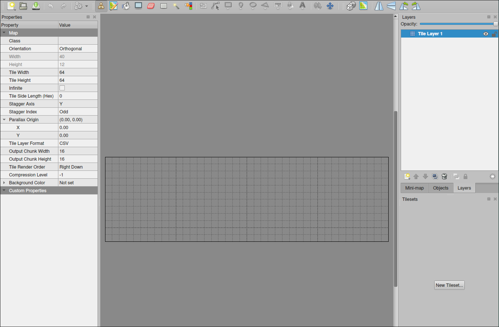

# Platformer project 15: Design levels with Tiled

So far, we have only created some colliders in one screen. If we want to truly create a level, we usually use a level editor to help us. Here we will use Tiled to create our level.

```sh
 sudo pacman -S tiled # install Tiled
 tiled # start Tiled
```


Choose "Orthogonal" for the Orientation, "CSV" for the Tile Layer Format, and "Right Down" for the Tile Render Order in order to work with love2d.

Tile size is 64pxx64px for our project, and Map size is 40 tiles wide and 12 tiles high like a Mario level but no vertical scrolling (only horizontal).

The love2d default screen size is 800x600, we want to make the screen vertical size to match the map height, so we set the screen size to 1000x768 as below:

```lua
function love.load()
  love.window.setMode(1000, 768)  -- set the window(screen) dimensions to 1000x768
  ...
end

...

```

Click `OK` then you will see the grid of the map. You can draw the map by selecting the tile on the right-bottom corner and click on the map.



But it is obvious that we have not loaded any tiles into Tiled now, so we need to first load tiles into Tiled.

```sh
 tree
.
├── libraries
├── main.lua
├── maps # create a new folder named maps for the map file
│   └── tileset.png # download the tileset.png and put it in the maps folder
├── player.lua
└── sprites
```

Tilesets are images that contain all the tiles you want to use in your map. We can load the tileset.png into Tiled by clicking `New Tileset` in the right-bottom corner.


Set `Type` to `Based on Tileset Image`, check `Embed in map`, browse the tileset.png file into the `Source` field, `Tile width` and `Tile height` must match the tile size we set in the map, and `Margin` and `Spacing` are 0 for our tileset.png, then click `OK`.
(`Use transparent color` is for some types of images without a transparent background, but .png files usually have a transparent background, so we don't need to check it.)

Now, you can see the tileset on the right-bottom corner. And it is split into multiple 64x64 tiles which you can use to draw the map.


