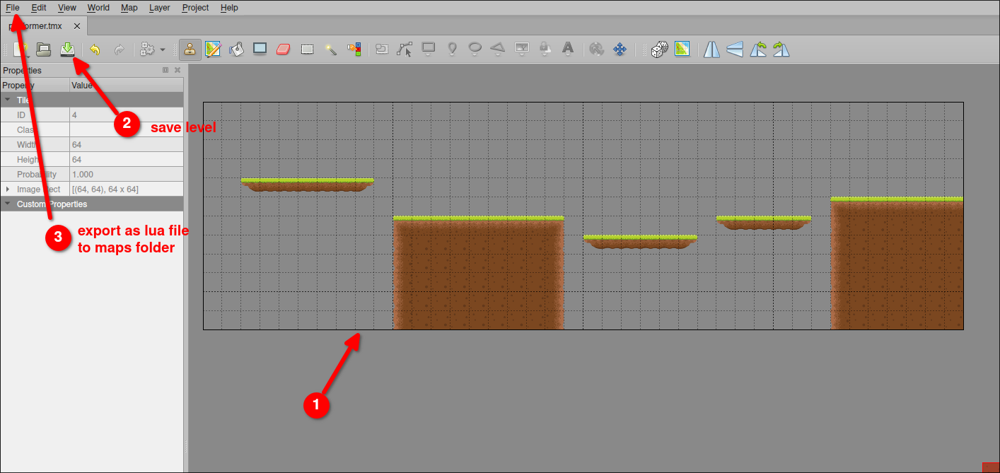

# Platformer project 16: Export Tiled map to love2d project

In [[2025-03-19_Platformer-project-15:-Design-levels-with-Tiled|Platformer project 15: Design levels with Tiled]], we've learned how to install Tiled and load tilesets to create levels. After creating levels, we need to save it and export it to a love2d project as a `.lua` file.


Now, what we need to do is to include the exported map lua file into our game. We could somehow code this ourselves, but there are lots of libraries that can help us with this. My favorite one is `STI` (Simple Tiled Implementation). Let's clone the repository and include it in our project.

```sh
 cd libraries/
 git clone git@github.com:karai17/Simple-Tiled-Implementation.git
 tree
.
├── anim8
├── Simple-Tiled-Implementation
│   ├── CHANGELOG.md
│   ├── doc
│   ├── LICENSE.md
│   ├── main.lua
│   ├── README.md
│   ├── spec
│   ├── sti # we want to include this folder to our game
│   │   ├── atlas.lua
│   │   ├── graphics.lua
│   │   ├── init.lua
│   │   ├── plugins
│   │   │   ├── box2d.lua
│   │   │   └── bump.lua
│   │   └── utils.lua
│   ├── tests
│   └── tutorials
└── windfield
```
```lua
function love.load()
  ...

  sti = require("libraries.Simple-Tiled-Implementation.sti")  -- include STI library
  gameMap = sti("maps/platformer.lua") -- load the map `platformer.lua` exported from Tiled

  ...
end

function love.update(dt)
  ...
  gameMap:update(dt) -- update the map
end

function love.draw()
  ...
  gameMap:drawLayer(gameMap.layers["Tile Layer 1"])  -- draw the map
  --                               ^^^^^^^^^^^^^^ when we draw the map, it is actually drawing the tile layer, we can check the name of the layer on the right-top corner of Tiled interface
end
...

```

Launch the game and check if the map is loaded correctly.


We can see that the map has been correctly loaded, but the colliders are not aligned with the tiles on the map. We will address this issue in another topic.

Another issue is that the wireframes used by the colliders debugger are being obscured by the tiles of the map, which will cause trouble for our future development. Adjusting the draw order can solve this problem.

```lua
...
function love.draw()
  gameMap:drawLayer(gameMap.layers["Tile Layer 1"]) -- move this line on top of the world:draw() to let the wireframes of the colliders be drawn on top of the map
  world:draw()
  ...
end
...

```

