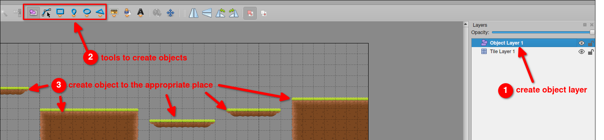

# Platformer project 17: Spawn objects from Tiled

In addition to tiles, we can also use Tiled to generate collider objects. We need to create an 'Object Layer' to draw collider objects in the appropriate positions.



After creating the object layer and drawing the collider objects, we need to export the map as a lua file again.

Currently, because there are multiple platforms, we are creating a table called `platforms` to store all the platforms, and we are changing the code that previously generated platforms to use the function `spawnPlatform` for reusability.

```lua
function love.load()
  ...

  platforms = {} -- create a table to store all platforms

  -- platform = world:newRectangleCollider(200, 400, 400, 40, {collision_class = "Platform"})  -- original codes to create a platform, now we are using the function spawnPlatform
  -- platform:setType("static")

  -- dangerZone = world:newRectangleCollider(0, 550, 800, 50, {collision_class = "Danger"}) -- we'll consider this part later, remove it for now
  -- dangerZone:setType("static")
end

...

-- create a function to spawn a platform
function spawnPlatform(x, y, width, height)
--                     ^^^^^^^^^^^^^^^^^^^ each platform will have different x, y, width, and height, so these values should be passed as arguments

  -- copy original codes to here for creating a platform as the same way as before
  local platform = world:newRectangleCollider(x, y, width, height, {collision_class = "Platform"})
--^^^^^ should be locala                      ^^^^^^^^^^^^^^^^^^^ replace the fixed values with the arguments
  platform:setType("static")

  -- add the platform to the platforms table
  table.insert(platforms, platform)
end

...

```

Now, we need to extract the collider objects from the Tiled map and spawn them as platforms with the `spawnPlatform` function.

```lua
function love.load()
  ...

  platforms = {}

  gameMap = sti("maps/platformer.lua") 
  -- iterate through the objects in the object layer and spawn platforms
  for _, obj in pairs(gameMap.layers["Object Layer 1"].objects) do
    spawnPlatform(obj.x, obj.y, obj.width, obj.height) -- spawn a platform with the object's x, y, width, and height
  end
end

...

function spawnPlatform(x, y, width, height)
  local platform = world:newRectangleCollider(x, y, width, height, {collision_class = "Platform"})
  platform:setType("static")
  table.insert(platforms, platform)
end

...

```

We can centralize the codes of sti into a function to make the code cleaner.

```lua
function love.load()
  ...

  platforms = {}

  loadMap() -- wrap the codes of loading the map into a function
end

...

-- create a function to load the map to centralize the codes of sti
function loadMap()
  gameMap = sti("maps/platformer.lua")
  for _, obj in pairs(gameMap.layers["Object Layer 1"].objects) do
    spawnPlatform(obj.x, obj.y, obj.width, obj.height)
  end
end

```

When we export the map, sometimes there may be some invisible objects causing bugs to occur. We can add some conditions to avoid generating these invisible objects.

```lua
...
function spawnPlatform(x, y, width, height)
  if width > 0 and height > 0 then -- add a condition to avoid generating invisible objects
    local platform = world:newRectangleCollider(x, y, width, height, {collision_class = "Platform"})
    platform:setType("static")
    table.insert(platforms, platform)
  end -- close the condition
end
...

```
