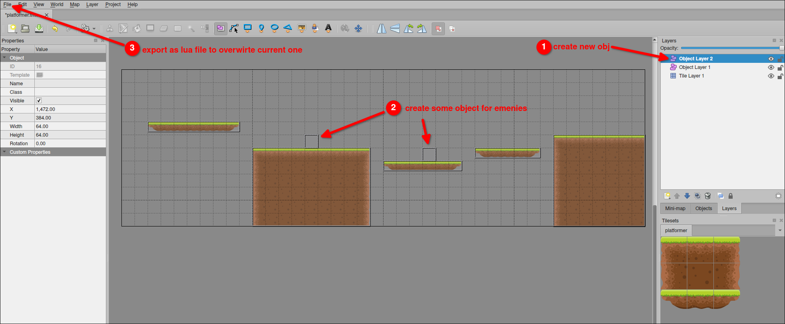

# Platformer project 21: Create Enemy Objects by Tiled

We can use Tiled to create a new Object Layer in the map, and create enemy objects inside.



```lua
-- main.lua
function love.load()
  ...

  require("player")
  require("enemy")

  platforms = {}

  -- spawnEnemy(960, 320) -- remove this line, we want to spawn enemies from Tiled
  loadMap()
end

...

function loadMap()
  gameMap = sti("maps/platformer.lua")
  for _, obj in pairs(gameMap.layers["Object Layer 1"].objects) do
    spawnPlatform(obj.x, obj.y, obj.width, obj.height)
  end

  -- spawn enemies from the object of Object Layer 2, which is the enemy layer
  for _, obj in pairs(gameMap.layers["Object Layer 2"].objects) do
    spawnEnemy(obj.x, obj.y) -- spawn enemy at the position of the object
  end
end

```

Launch the game, and you will see the enemies are spawned at the positions you set in Tiled.

