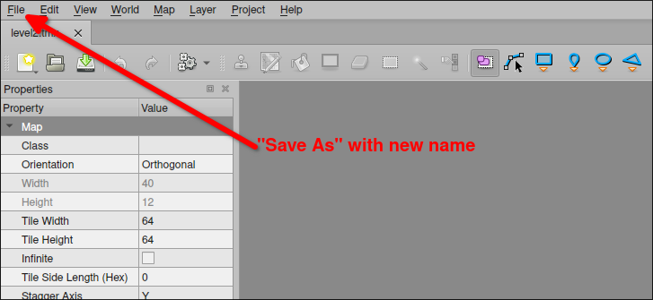

# Platformer project 22: Create another level by Tiled

We have already created a level using Tiled, including tiles, platforms, and enemies. Now we are going to create another level.

We use Tiled to open the original level, then Save As a new level file, because this will retain the loaded tiledset and map layers, so we can directly modify the new level.



If you want to clear the content of each layer, you can directly select the layer, press Ctrl + A to select all, and then press Delete to clear the content of the layer.

After editing, remember to export it as a lua file and place it in the corresponding directory of the project.

Then we can modify the file name of the map loaded in the codes to test if the new level can be successfully executed.

```lua
...

function loadMap()
  gameMap = sti("maps/level2.lua")
  --                  ^^^^^^^^^^ change the file name here
  for _, obj in pairs(gameMap.layers["Object Layer 1"].objects) do
    spawnPlatform(obj.x, obj.y, obj.width, obj.height)
  end
  for _, obj in pairs(gameMap.layers["Object Layer 2"].objects) do
    spawnEnemy(obj.x, obj.y)
  end
end
