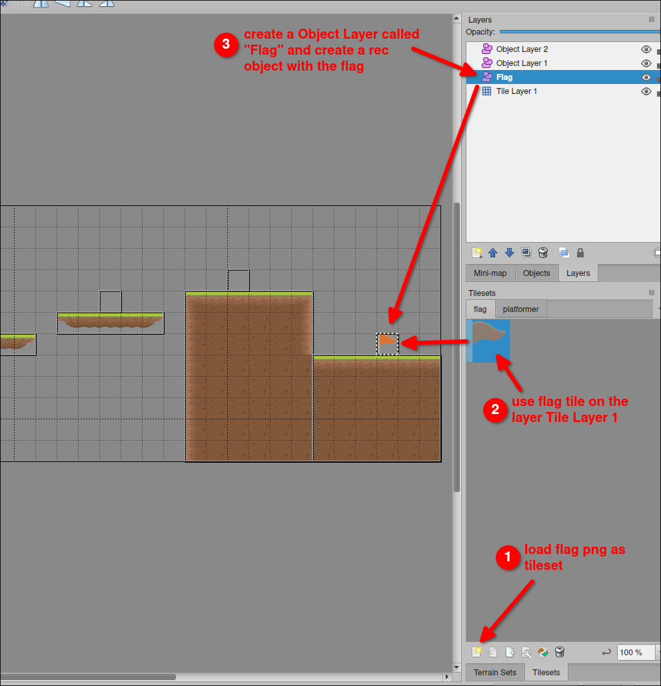

# Platformer project 24: Levels transition by flags

In [[2025-03-21_Platformer-project-23:-Levels-transition-basic|Platformer project 23: Levels transition basic]], we switched between levels by pressing a key just for testing purposes. Now we will switch levels by flags.

First, we download an image of a flag and put it in the folder `maps`, because we want to load it as a tileset in Tiled and add it to the map.

```sh
 tree
.
├── enemy.lua
├── libraries
├── main.lua
├── maps
│   ├── flag.png # <-- downloaded image for the flag
│   ├── level1.lua
│   ├── level2.lua
│   ├── level2.tmx
│   ├── platformer
│   ├── platformer.tmx
│   └── tileset.png
├── player.lua
└── sprites
```

Then, we open Tiled and add the flag to the tileset and put it in the Tile Layer 1 of the map `level1.tmx` and `level2.tmx`.

Next, we create a new layer in the map `level1.tmx` and `level2.tmx` called `flag` and create a rectangle object on the flag tile.



After that, don't forget to export the map as `level1.lua` and `level2.lua` to overwrite the old files.

Now, we can extract the flag object from the map and assign it's x and y value to new table `flag` to track the flag position.

```lua
function love.load()
  ...

  -- create a table to store the flag position
  flag = {}
  flag.x = 0
  flag.y = 0

  loadMap('level1')
end

...

function loadMap(mapName)
  destroyAll()
  gameMap = sti("maps/" .. mapName .. ".lua")
  for _, obj in pairs(gameMap.layers["Object Layer 1"].objects) do
    spawnPlatform(obj.x, obj.y, obj.width, obj.height)
  end
  for _, obj in pairs(gameMap.layers["Object Layer 2"].objects) do
    spawnEnemy(obj.x, obj.y)
  end

  -- extract the flag object from the map, and assign it's x and y value to flag table
  for _, obj in pairs(gameMap.layers["Flag"].objects) do
    flag.x = obj.x
    flag.y = obj.y
  end
end
```

After we have the location of the flag, we can use query colliders to continuously check if the player has touched the flag, and switch to the next level.

```lua
function love.load()
  ...

  flag = {}
  flag.x = 0
  flag.y = 0

  loadMap('level1')
end

function love.update(dt)
  ...

  -- check if the player has touched the flag
  local colliders = world:queryCircleArea(flag.x, flag.y, 10, {"Player"})
  if #colliders > 0 then
    loadMap('level2')  -- if the player has touched the flag, switch to the next level
  end
end

...

function loadMap(mapName)
  destroyAll()
  gameMap = sti("maps/" .. mapName .. ".lua")
  for _, obj in pairs(gameMap.layers["Object Layer 1"].objects) do
    spawnPlatform(obj.x, obj.y, obj.width, obj.height)
  end
  for _, obj in pairs(gameMap.layers["Object Layer 2"].objects) do
    spawnEnemy(obj.x, obj.y)
  end
  for _, obj in pairs(gameMap.layers["Flag"].objects) do
    flag.x = obj.x
    flag.y = obj.y
  end
end
```

Lauch the game and try to touch the flag, you will see the game switch to the next level but the player still at the same position. We need to move the player to the start position of the next level.

```lua
...

function loadMap(mapName)
  destroyAll()
  player:setPosition(300, 100)  -- move the player to the start position whenever the level is switched
  gameMap = sti("maps/" .. mapName .. ".lua")
  for _, obj in pairs(gameMap.layers["Object Layer 1"].objects) do
    spawnPlatform(obj.x, obj.y, obj.width, obj.height)
  end
  for _, obj in pairs(gameMap.layers["Object Layer 2"].objects) do
    spawnEnemy(obj.x, obj.y)
  end
  for _, obj in pairs(gameMap.layers["Flag"].objects) do
    flag.x = obj.x
    flag.y = obj.y
  end
end
```
