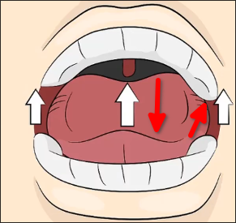

# How to pronounce ɑː sound?

You need to open your mouth, lower your tongue and retract it backwards to produce the sound ɑː.

So it's also called the dentist vowel sound because as you can imagine, in a dentist's chair, you're asked to open your mouth wide and say "ahh".

