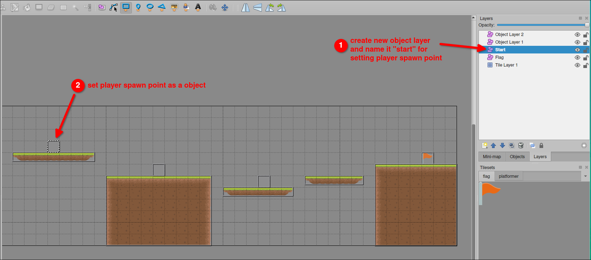

# Platformer project 30: set the player spawn point for each level by Tiled

In [[2025-03-22_Platformer-project-29:-Danger-Zone-again|Platformer project 29: Danger Zone again]], we store the player spawn point in the variables, but they are never changed. But in different levels, the player spawn point may be different. So we need to set the player spawn point for each level. We can do this by using Tiled to set the player spawn point easily.


Set the player spawn point by Tiled as above figure in each level. And then export each level to the lua files to overwrite the original level files.

Now we can extract the player spawn point from the level files by STI library whenever loading the level and set the player spawn point to the variables.

```lua
...

function loadMap(mapName)
  saveData.currentLevel = mapName
  love.filesystem.write("data.lua", table.show(saveData, "saveData"))
  destroyAll()

  -- player:setPosition(playerStartX, playerStartY) -- move this line after `playerStartX` and `playerStartY` are reset 

  gameMap = sti("maps/" .. mapName .. ".lua")
  -- extract the player spawn point from the level files and set the player spawn point to the variables
  for _, obj in pairs(gameMap.layers["Start"].objects) do
    playerStartX = obj.x
    playerStartY = obj.y
  end
  -- then set the player spawn point to the player
  player:setPosition(playerStartX, playerStartY)

  for _, obj in pairs(gameMap.layers["Object Layer 1"].objects) do
    spawnPlatform(obj.x, obj.y, obj.width, obj.height)
  end
  for _, obj in pairs(gameMap.layers["Object Layer 2"].objects) do
    spawnEnemy(obj.x, obj.y)
  end
  for _, obj in pairs(gameMap.layers["Flag"].objects) do
    flag.x = obj.x
    flag.y = obj.y
  end
end
```

Now the variables `playerStartX` and `playerStartY` will be reset whenever loading the level. So the player spawn point will be set to the player correctly.

