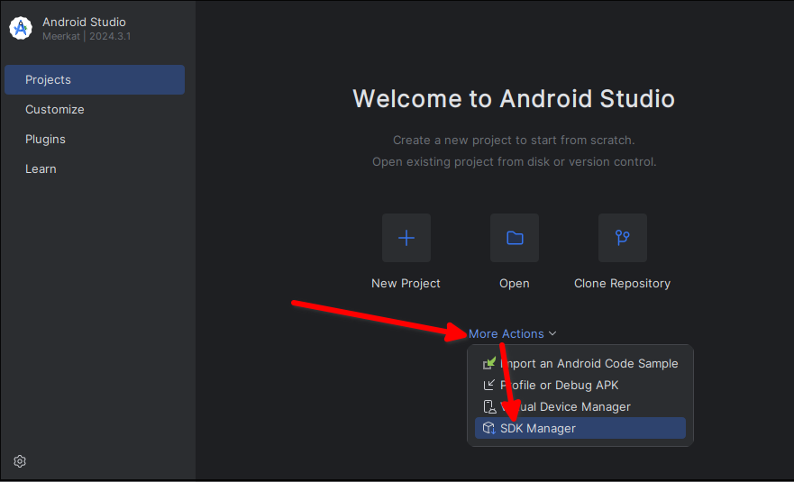
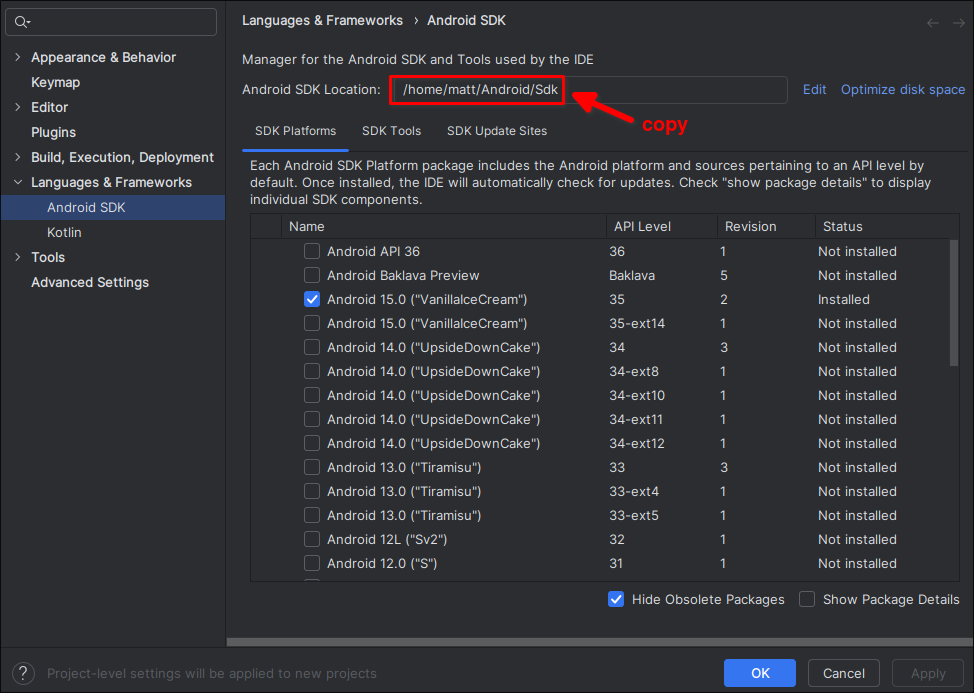
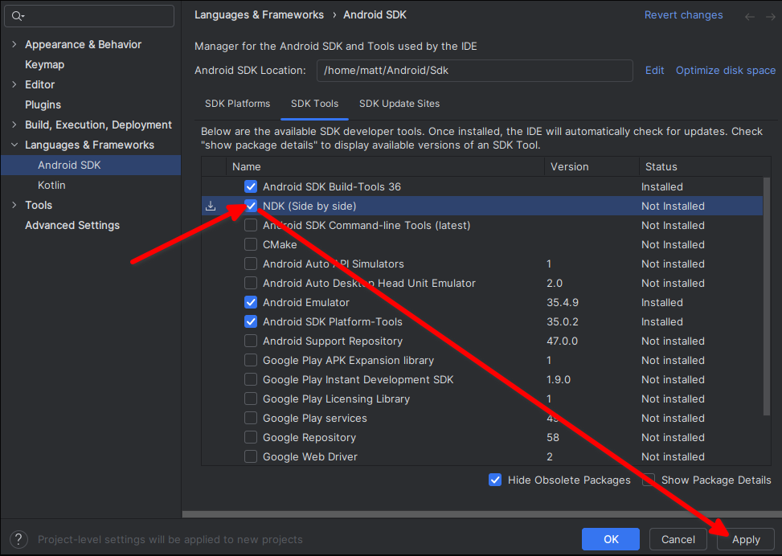
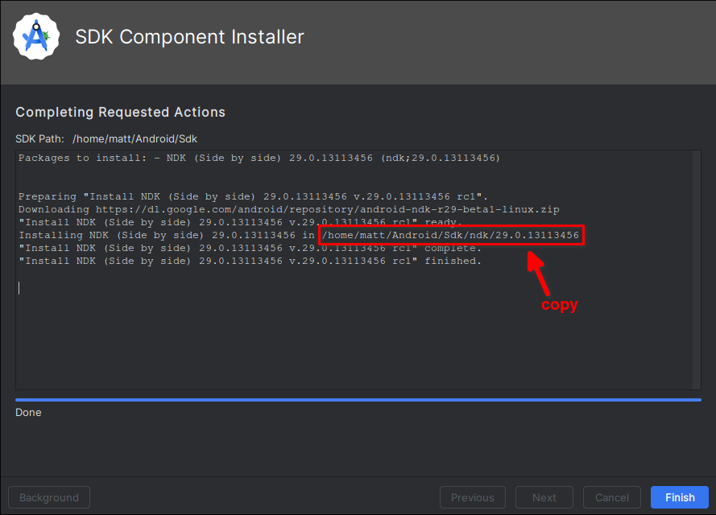

# Three required tools and evironment variables

In order to run our game on Android, we need to convert it into an APK file. We can use the love-android tool to help us complete this task, but before using love-android, we need to install Android SDK, Android NDK, and set up the environment variables.

## love-android GitHub repository
```sh
git clone --recurse-submodules https://github.com/love2d/love-android
```

## Android SDK and NDK

We need to install Android SDK and NDK through Android Studio, and set the environment variables `ANDROID_HOME` and `ANDROID_NDK_HOME`.

```sh

yay -S android-studio
android-studio # Open Android Studio and next next next ...
```





Set the environment variables `ANDROID_HOME` to be Android SDK location above.






File: /home/matt/.config/fish/config.fish
```fish
...
set -gx ANDROID_HOME "/home/matt/Android/Sdk"
set -gx ANDROID_NDK_HOME "/home/matt/Android/Sdk/ndk/29.0.13113456"
...
```
