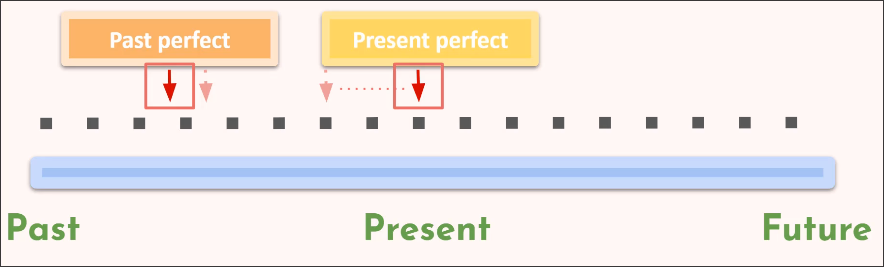

# Past Perfect + Present Perfect

These tenses are used to discuss events in the past and events happening up to now.

## Past perfect

We're saying an event happened before something else, so we're concentrating on an event happening.

So there are two events in the past perfect sentence, but the focus is on the on that happened first.

## Present Perfect

The present perfect is talking about now we're looking at the *result* of an action that's been ongoing for an unspecified amount of time.

But really, we talking about the *result* of previous ongoing action.

