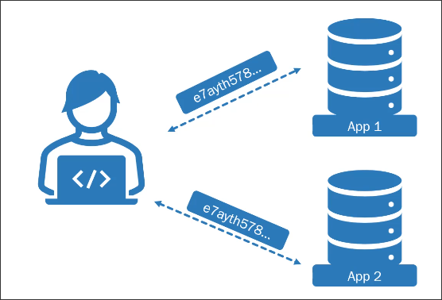

# JWT pratical use cases

## A company owns two applications

Imagine this scenario: A single company or enterprise has multiple different applications that many different users work with. For example, let's say you want to get into cryptocurrency and app. One is cryptocurrency market where you can buy and sell many different types of cryptocurrencies. Let's say the same company that owns app one, also has another application where you can store cryptocurrencies in a digital wallet.

Now, if you are the company that owns both applications, you do not want you user to have to sign into one application to buy cryptocurrencies and then techically have to sign into a completely different application to move their cryptocurrencies into a digital wallet.

It would be a much better experience if the user did not even know that there was two seperate applications and that the user experience between the two applications were not even noticeable. This is possible if app one and app two to share the same secret. This means both servers would be able to handle decoding the JWT and know exactly who the user is that is trying to perform the action.

## Microservices and APIs

Using JWT is extremely popular in modern architectures like microservices, where each API may be loosely coupled and in some cases completely stateless but require user information. These micro services or micro APIs can find the user by decoding tokens and nver having to implement authentication or authorization within the specific API.

