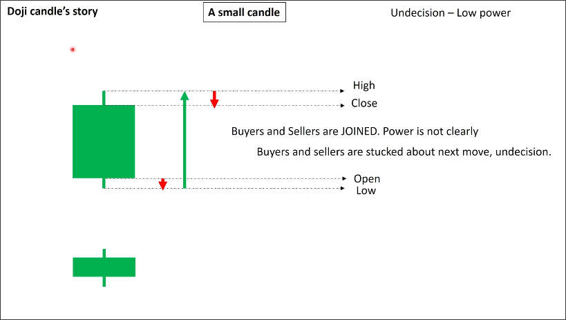
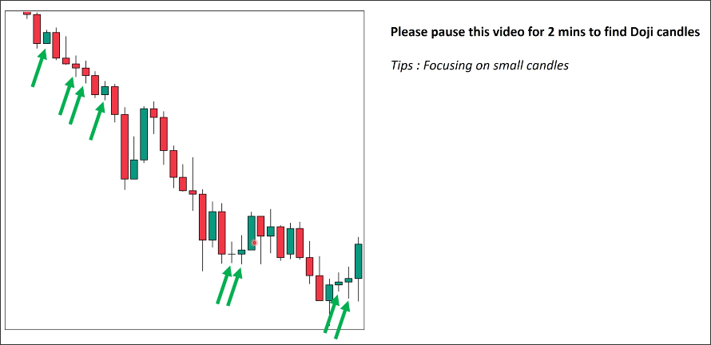

# Doji candle

## Definition

Small candle, the distance between high and low is obviously smaller than other candles.

## Story

Because the distance between high and low is small, the fluctuation is weak in this period. It just means buyers and sellers are not interested at this period. So when we see this candle, we should just skip it because it has no story.

## Example

Even we can just skip them in the chart, but we still need to know how to identify them because doji candles can be used as a confirmation candle in the price action power.

