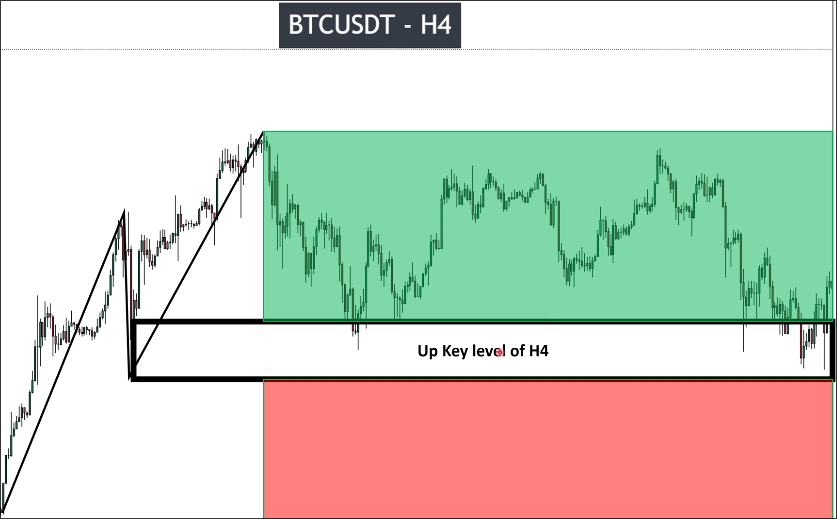
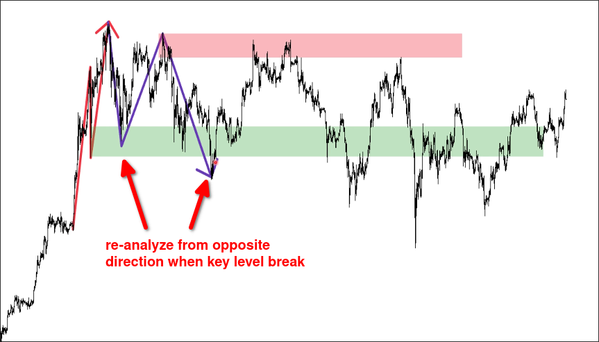

# How to define TREND with Market structure

When the key level is broken, the trend will change.

When the trend changes, we need to reanalyze the pulse wave, pullback wave, and key level from the another direction. It is important to note that these analyses have no relation to the previous trend and must be reanalyzed from a different perspective.

Below is a visual example of how to split the two zones by key level and reanalyze from the opposite direction.

