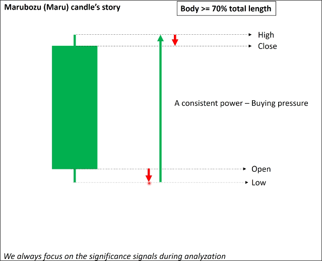
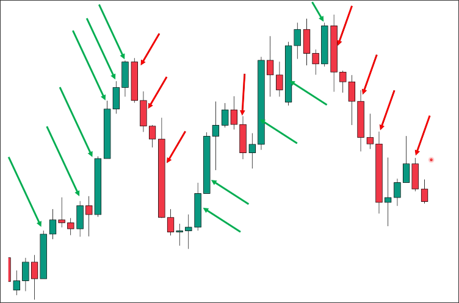

# Marubozu candle

## Definition

A Marubozu candle is a candle where the body occupies more than 70% of the length of the candle.

## Story

The above image shows a rising Marubozu candle. After opening, there was a slight selling pressure that caused the price to drop to the low. Then, a consistent buying pressure emerged, causing the price to rise from the low to the high. Afterwards, there was some slight selling pressure that caused the price to drop to the close.

The characteristic of a Marubozu candle is that it has consistent power and relatively weak reverse pressure, which is very helpful for the continuity of the market.

## Example

When unsure if it is a Marubozu candle, please use TradingView's tools and calculator to accurately calculate if the length of the body exceeds 70% of the entire candlestick.

