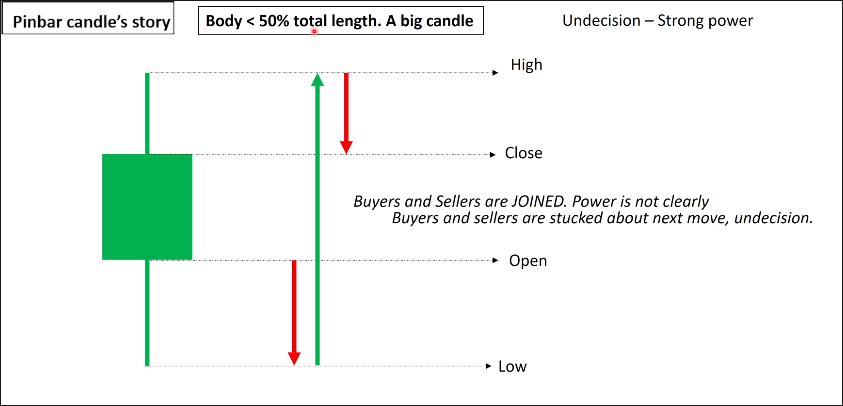
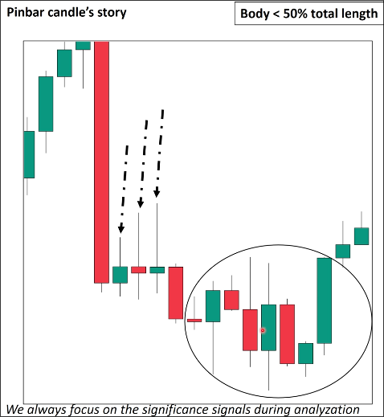

# Pinbar candle

## Definition

Body length is less than 50% of the entire candlestick. And Pinbar candle should have a long length.

## Story

Above is a pinbar candle, with significant selling pressure after opening causing a drop to the low, followed by significant buying pressure pushing it up to the high, and finally significant selling pressure again leading to a drop to the close.

Although the pinbar candle contains strong power, the strength of buying pressure and selling pressure is significant, so the direction is unclear.

Pinbar candle, regardless of its color, always signifies undecision, so we do not care about the color of the Pinbar candle.

## Example

In the above chart, the consecutive appearance of three pinbar candles suggests that the market direction is uncertain and both sellers and buyers are actively involved, leading to significant fluctuations later on.

When the market direction is uncertain, it is advisable to avoid entering the market. This is one of the most common mistakes made by beginners.

