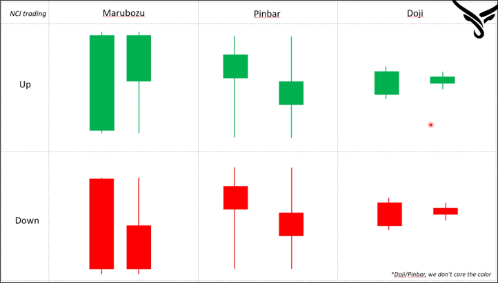

# Three candles types must know before trading and investing

There are three types of candles that traders and investors should be familiar with:

**Marubozu**
Big body candle or candle with long tail. Inside these candles have strong buying or selling pressure.

**Pinbar**
Pinbar candle you can see the tail on the top or bottom. This candle indicates both buying and selling pressure all join at the same time.

**Doji**
It means the length of candles is very small. And for the doji candle actually have no any story behind.

> For Doji and Pinbar candles, we don't care the color.

> You should explain and judge the candle based on the real story, based on the real pressure behind the candle. Shape of the candle is only one factor. The key factor is the pressure behind the candle.

