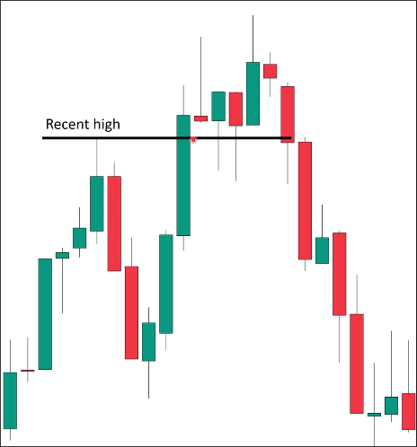
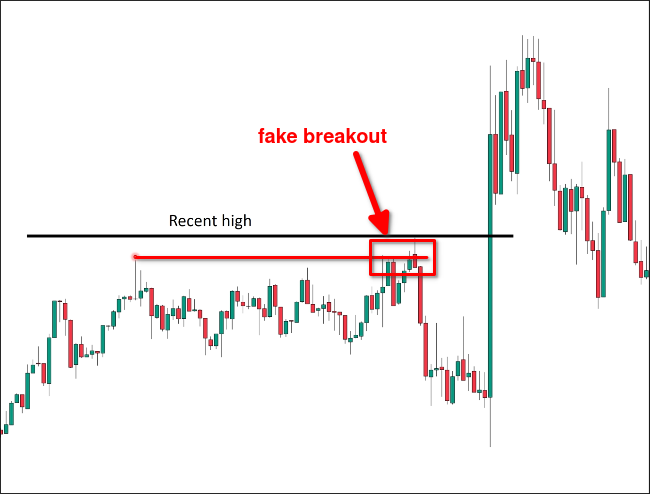

# Big marubozu and one confirmation candle in break out standard (different color)

## Conditions

The first two conditions are the same as [[2025-04-04_Big-marubozu-candle-and-one-confirmation-candle-(different-color)|Big marubozu candle and one confirmation candle (different color)]], but there is one more condition:

> More than 30% body of the first candle is above (or below) BOI
(just the same as [[2025-04-04_Big-marubozu-and-one-confirmation-candle-in-break-out-standard-(same-color)|Big marubozu and one confirmation candle in break out standard (same color)]])

## Example

**invalid break out**:

The chart above is not considered a valid breakout because the length of the second line exceeds the length of the first line by 30, it should be considered a fake breakout.

**valid break out**:

In the chart above, the range has experienced a fake breakout. When confirming the breakout next, we must use the high point of the fake breakout as BOI instead of the previous high point.

