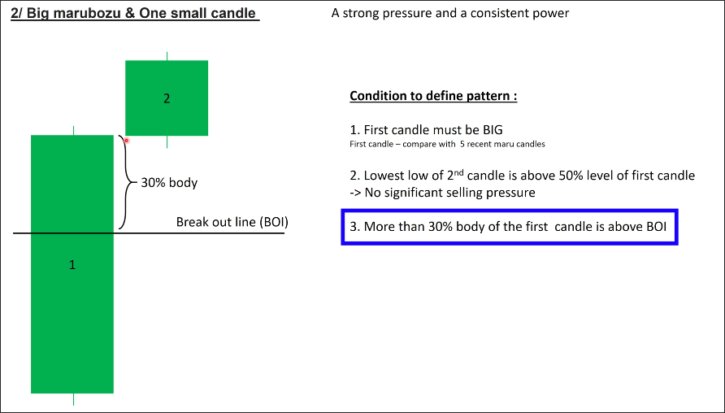
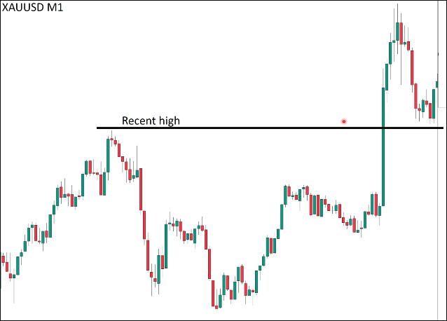
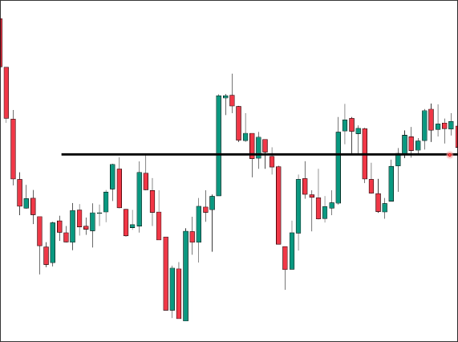
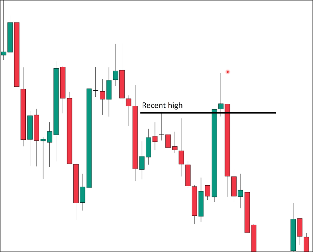

# Big marubozu and one confirmation candle in break out standard (same color)

## Conditions

The first two conditions are the same as [[2025-04-04_Big-marubozu-candle-and-one-confirmation-candle-(same-color)|Big marubozu candle and one confirmation candle (same color)]], but there is a third condition about the BOI:

> More than 30% body of the first candle is above (or below) BOI

## Example

**valid breakout**

**invalid breakout**

