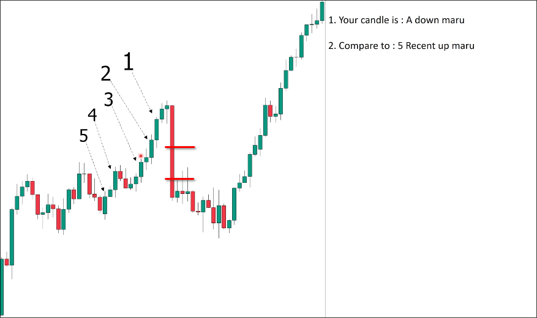

# Big marubozu candle and one confirmation candle (same color)

## Conditions

- First candle must be BIG
compared with 5 recent **maru** candles on the left side. It should be at least greater than all 5 candles, better if it is obviously bigger than the biggest one of them.

- The second candle's low point should be greater than the middle point of the first candle.

## Example

The first big down maru candle in the above chart is obviously larger than the previous 5 maru candles. The high point of the second small candle is also clearly lower than the middle point of the first candle, confirming that this is an valid pullback.

