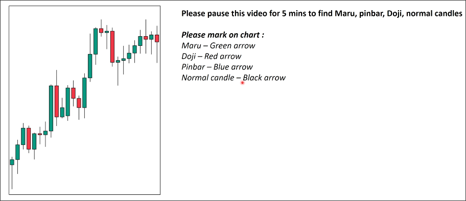
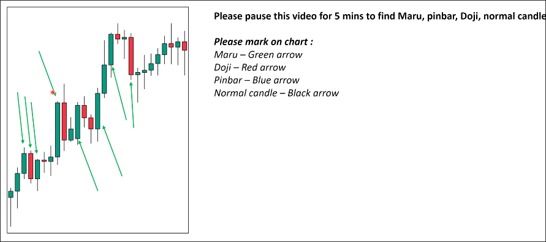
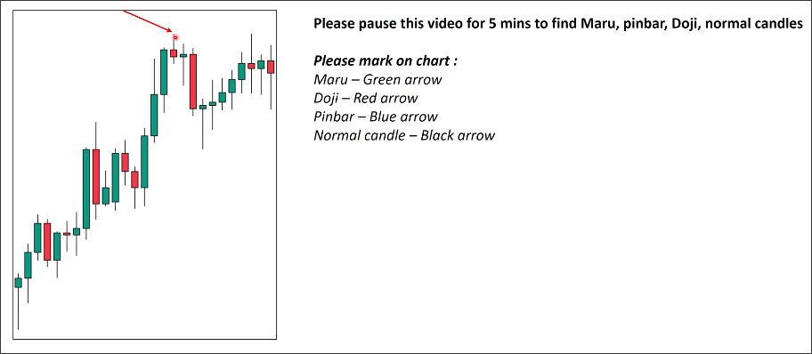
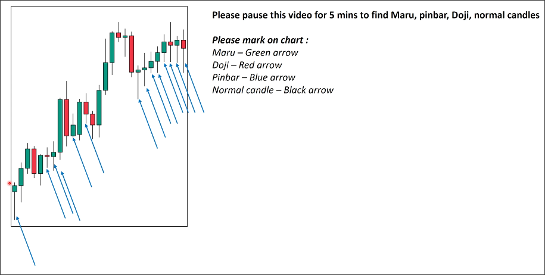
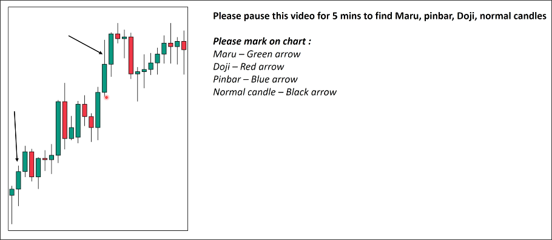

# Normal candle

Any candle that is not a Maru, Doji, or Pinbar candle is a normal candle.

## Example

In the above chart, in order to find the Normal candle, we must exclude Maru, Doji, and Pinbar, so that we can identify the Normal candle.

First exclude Maru candles:

Then exclude Doji candles:

Finally exclude Pinbar candles:

So, the remaining candles are Normal candles:

The tail of the second candle in the above picture, if it were below, could be considered a special maru candle. Unfortunately, the tail is above, so it is a normal candle.

## Story

The story of the normal candle is not clear, so we don't need to worry about it. Only the story behind Maru and Pinbar is clear enough to be helpful to us.

