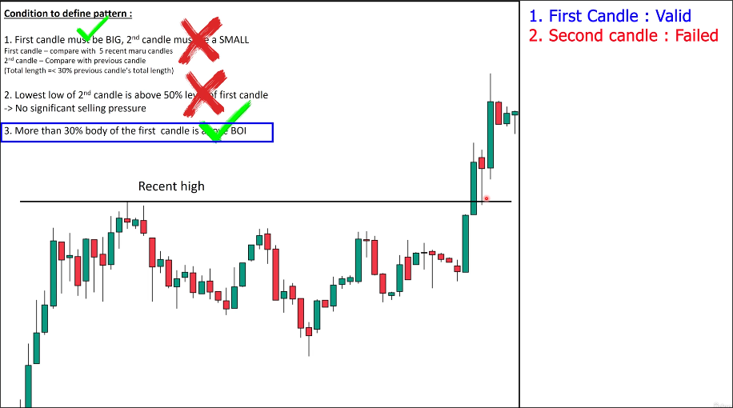
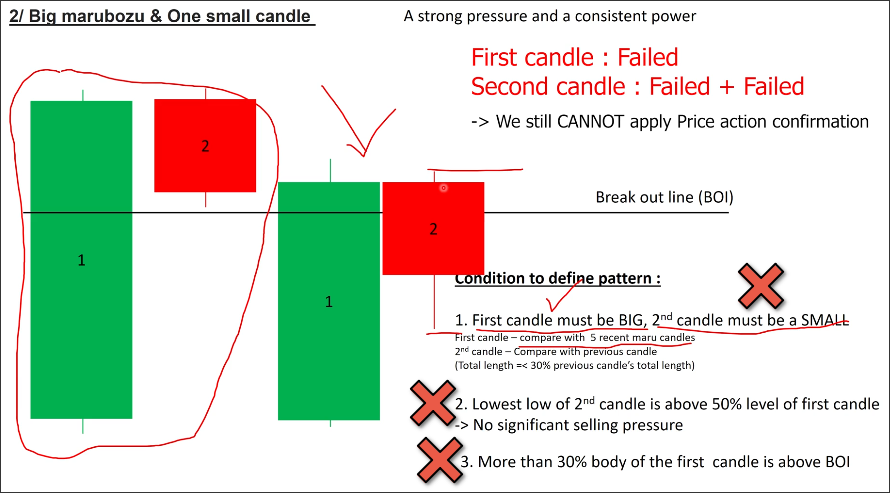

# Price action confirmation in breackout

If one candle in the [[2025-04-04_Break-out-standard|break out standard pattern]] does not meet the criteria, we can wait for price action confirmation to confirm the validity of the breakout.

Note that it is ONE CANDLE, not ONE CONDITION failed, so it is possible that multiple conditions have failed but price action confirmation can still be used, as in the example below.

In the above chart, the first candle meets all conditions, but the second candle does not meet the conditions of being small and having the lowest low above the middle of the first candle. However, because only one candle does not meet the conditions, price action confirmation can still be used to confirm the validity of this breakout.

Price action confirmation is completely identical to the method of [[2025-04-04_Price-action-confirmation-in-pullback|price action confirmation in pullback]].

Below are two situations where both candles failed, so price action confirmation cannot be used:

