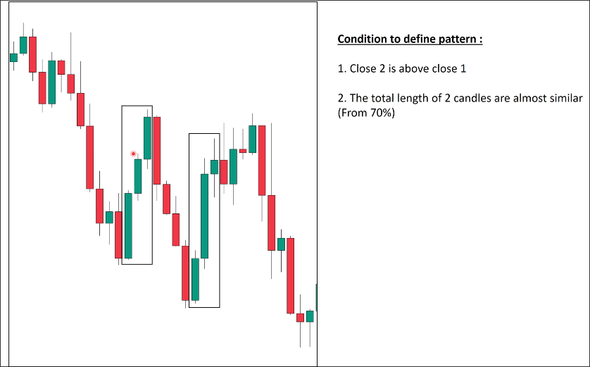

# Pullback standard: Two marubozu candles

## Condition to define pattern

- Close of the second marubozu candle is higher (or lower) than the close of the first marubozu candle.

- The total length of the first marubozu candle is greater than 70% of the total length of the second marubozu candle.

## Example

### First pullback wave

There are three marubozu candles in this pullback wave. So we can first take the first and second marubozu candles to check if they meet the conditions.

Because the length of the second marubozu candle did not exceed 70% of the first marubozu candle, this set of marubozu candles did not make this pullback wave a valid pullback wave.
(Actually, this set of marubozu candles meets the conditions of the second standard, but we are using it as an example so we pretend that this set does not meet the conditions.)

We continue to use the second and third marubozu candles to check if they meet the conditions. This set of marubozu candles meets the conditions, so it confirms that this pullback wave is an effective pullback wave.

### Second pullback wave

Check the first and second marubozu candles. This set of marubozu candles meets the conditions, so it confirms that this pullback wave is an valid pullback wave.

## Conclusion

In the pullback wave, we only need to find an effective combination of marubozu candles, and we will not do excessive analysis or interpretation. We should focus on the key parts in order to achieve consistent trading.
