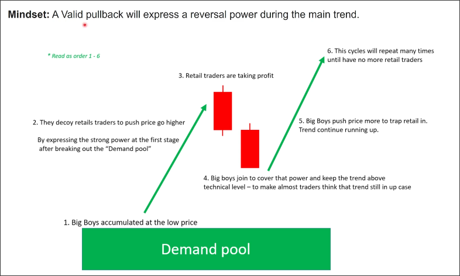

# Pullback story (mindset)

## Stable trend

### definition
- Pulse wave is longer
- Pullback is shorter

### features
- A stable trend will have a lot of pullbacks
- Pullback is the key level

## Pullback story

A valid pullback will express a reversal power during the main trend.

**First pulse wave**:
1. Big Boys accumulated at the low price
2. They decoy retail traders to push price go higher

By expressing the strong power at the first stage after breaking our the **Demaind pool**

**First pullback**:
3. Retail traders are taking profit
4. Big boys join to cover that power and keep the trend above technical level - to make almost traders think that trend still in up case

**Second pulse wave**:
5. Big Boys push price more to trap retail in. Trend continue running up.
6. Retail traders join the trend and push price up
...

This cycle will repeat many times until have no more retail traders and also big boys take profit then the trend will reverse.

**Demand pool** is where the big boy costs are located, equivalent to the **key level**, it will continue to move up (or down) as the big boy enters the market.
