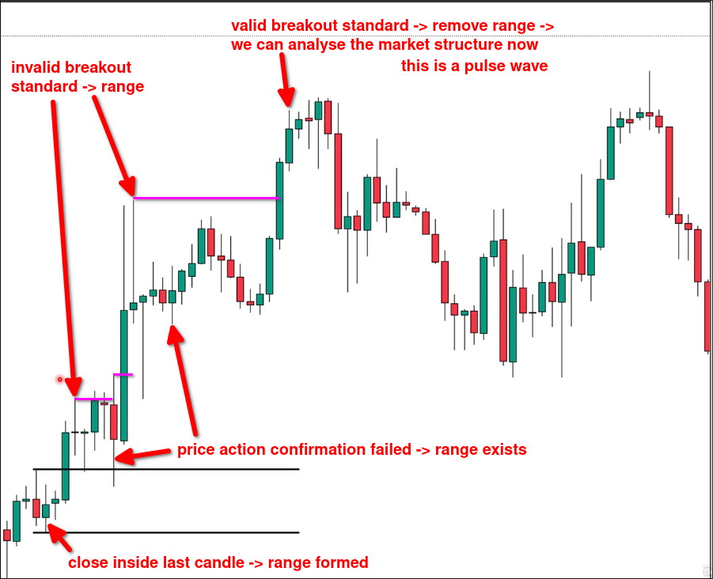

# Range by fake breakout

When market failed breakout even using price action to confirm. A range is formed.

In the above chart, the price broke through the initial range high but it was a fake breakout. The fake breakout itself formed a range and overlapped with the initial range. At this point, we need to merge the two ranges together.

After the noise ends, we can continue analyzing the market structure.

