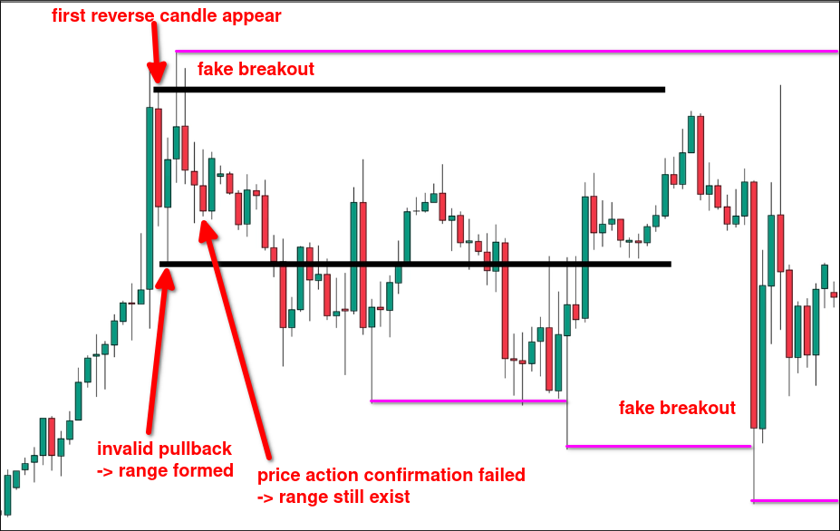
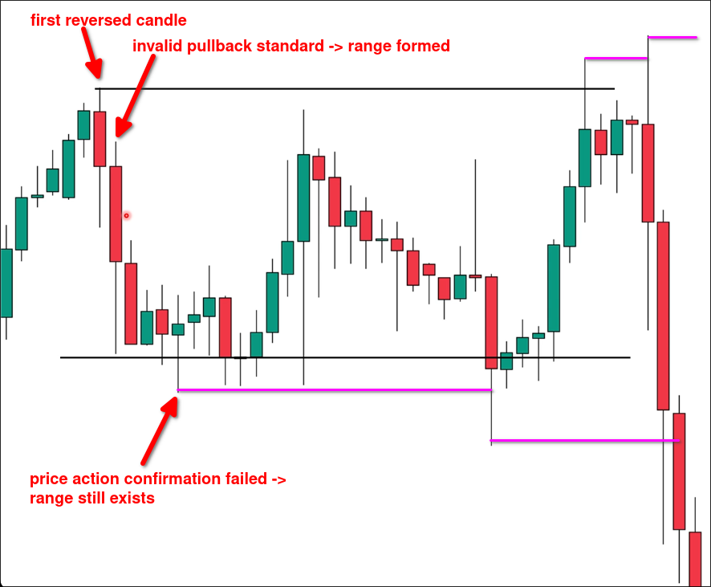

# Range by invalid pullback

When market failed pullback even using price action to confirm, a range is formed.

You need to wait for the first candle that is opposite to the trend to appear, and then use the pullback standard when the second candle appears after it to determine if it is valid. If it is not valid, these two candles form a range, but if the price action confirms success later, it is a valid pullback and the range disappears.

