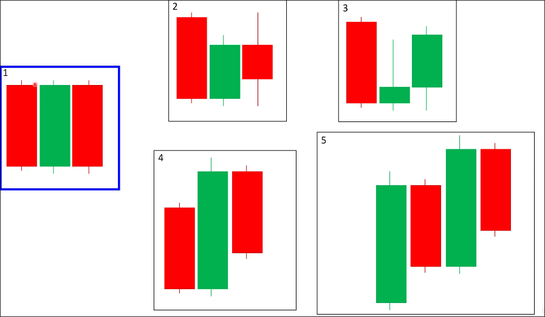
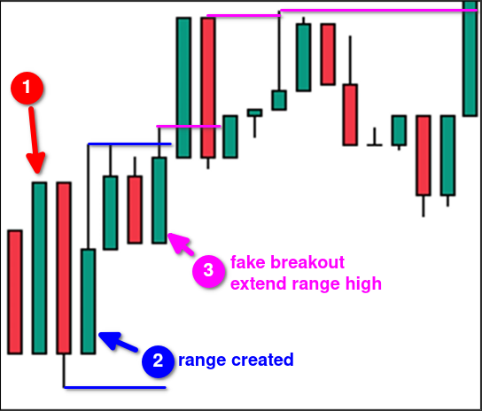

# Range by marubozu or normal candle

When a marubozu or normal candle appears, if the close price of any candle in the second to fifth candles that follow falls within the range of the marubozu or normal candle, it can be considered as the formation of a range.

The combinations in the following image all form a range.

From the above examples, we can see that even though the close price of the candle in the process is outside the range of the first candle, as long as one of them eventually closes within the range of the first candle, it can be considered as the formation of a range.

Here are some more real examples:

We can find that after the range is formed, fake breakouts will continue to occur. At this time, we need to expand the range area. This means that the noise of market is getting bigger and the situation is becoming more unstable. We must wait for a valid breakout of the range before entering the market.
