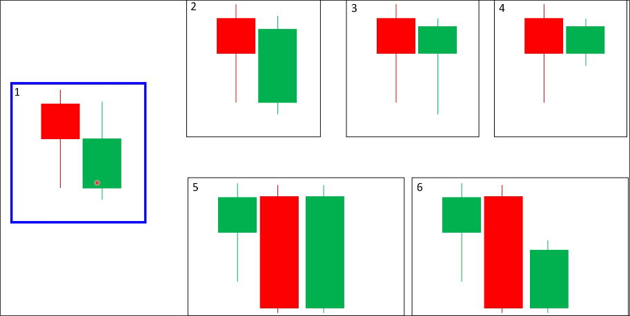
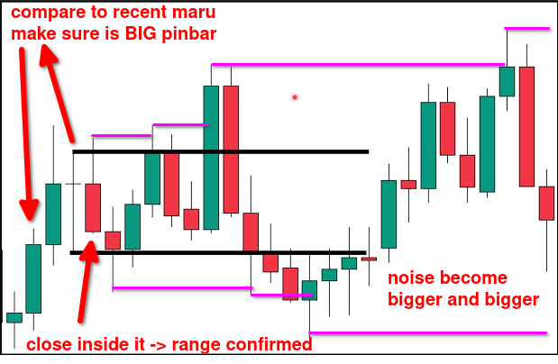

# Range by pinbar or doji candle

When a pinbar or doji appears, if the close price of any one of the first to fifth candles that appear afterwards is within the range of the pinbar or doji, it can be considered as forming a range.

Compared to normal candles and marubozu candles, pinbars and dojis are from the first to the fifth candle. This is because pinbars and dojis themselves represent a battle between buyers and sellers, and can be seen as an initial range. Therefore, as long as the closing price of the first candle appears within the range of the pinbar or doji, it can be considered that the range is forming.

But we usually only pay attention to big pinbar candles, because the range of small candles can easily be broken.

The method to determine if a pinbar is big is to compare the length of the most recent marubozu candle. As long as the length of the pinbar is greater than 50% of the length of the marubozu candle, it can be considered a big pinbar.

Here are some examples:

You can find that when the range is formed by a pinbar, it is very easy for the range to form on the second candle, compared to a range formed by a marubozu.

This is because the pinbar candle itself is the result of a battle between bulls and bears, and can be seen as a preliminary range, so the second candle is more likely to close within its range.

Here is a more realistic example:

In this example, we see a long tail pinbar candle, first, we compare the length of the pinbar with the length of the most recent marubozu candle to determine if it is a big pinbar. Then, right after the pinbar candle, we see a candle closed within the range of the pinbar candle, which is a good sign that the range is forming. After that, we see a lots of fake breakouts to make the range area bigger and bigger. It make the market very complicated, as a smart trader, we should not entry the market until we see a valid breakout.
