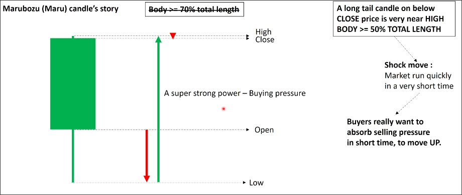
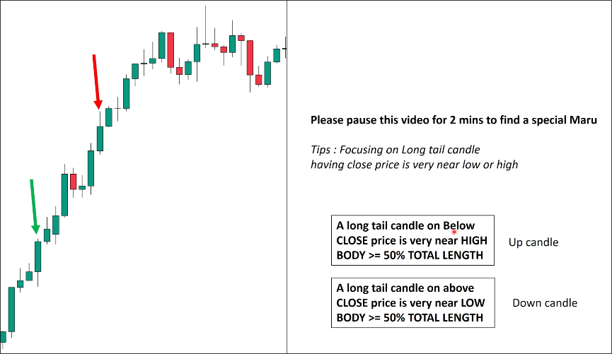

# Special Marubozu candle

## Definition

- long tail from open to low (or high)
- distance from close to high (or low) is small ( < 10% of entire candle)
- body >= 50% of entire candle

## Story

1. Open to low

At the beginning, strong selling pressure appeared, causing the price to drop from the open to the low.

2. Low to high

After reaching the low, very very strong buying pressure appeared and directly absorbed all selling pressure, causing the price to soar to the high point.

3. High to close

Rushing to a high point without a clear pullback indicates that the bulls are still very strong, causing prices to only fluctuate slightly near the high point.

**Shock move**
This candle prove that the market run quickly in a very short time, and the buyers really want to absorb selling pressure in shourt time, to move UP.

## Example

First find a candle with a clear long tail, then use TradingView's Fib retracement to measure if the distance from the close to the high (or low) is less than 10 candle bodies, and measure if the body is larger than 50 candle bodies. If both conditions are met, it can be considered a Special Marubozu candle.

Note that the direction of the tail must be from close to high (or low), if it is a long tail growing out from open, it is not considered a Special Marubozu candle.

