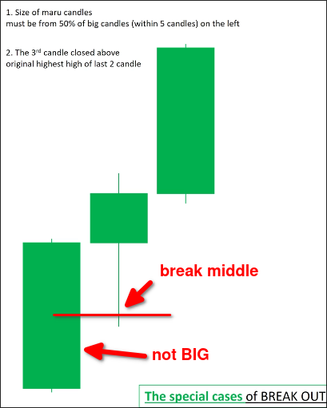

# Three special cases for pullback and breakout

## maru-pinbar-maru

The first two candles in front are invalid according to the standard of [[2025-04-04_Big-marubozu-and-one-confirmation-candle-in-break-out-standard-(same-color)|Big marubozu and one confirmation candle in break out standard (same color)]], so we cannot use [[2025-04-04_Price-action-confirmation-in-breackout|Price action confirmation in breackout]]. At this time, we can observe if the third candle is a marubozu, and if so, check if the following conditions are met, if so, it is a valid pullback or breakout:

1. Size of both marubozu candles must be from 50% of biggest one on the last five marubozu candles.
2. The third candle closed above original highest high of last 2 candles.

## pinbar-normal/maru-maru

When you see a long pinbar followed by a normal or maru candle, and its close is near its high point (or low point), we can observe if the third candle is a marubozu. If it is, as long as it meets the following conditions, it is a valid pullback or breakout:

1. Size of the third candle must be from 50% of biggest one on the last five marubozu candles.
2. The third candle closed above (or below) original highest high (or lowest low) of last 2 candles.

The story of this case is that the first pinbar represents the battle between bulls and bears, but the appearance of the second candle completely absorbs one side's power, and then the third candle confirms the strength of the other side.

## normal-normal-maru

- Two first candles have total length is from 50% of biggest one on the last five maru candles.
- The third candle must be from 50% of biggest one on the last five maru candles.
- Third candle closed above (or below) original highest high (or lowest low) of last 2 candles.

The story of this case is that although the first two normal candles were up, they both had selling pressure. However, the third candle completely absorbed the selling pressure of the first two candles, so in the end, a strong buying pressure was obtained.

## normal-normal-price-action-confirmation

- Two first candles have total length is from 50% of biggest one on the last five maru candles.
- The third candle must be from 50% of biggest one on the last five maru candles.
- When above two conditions are met, we can use price action confirmation to confirm the pullback or breakout.
