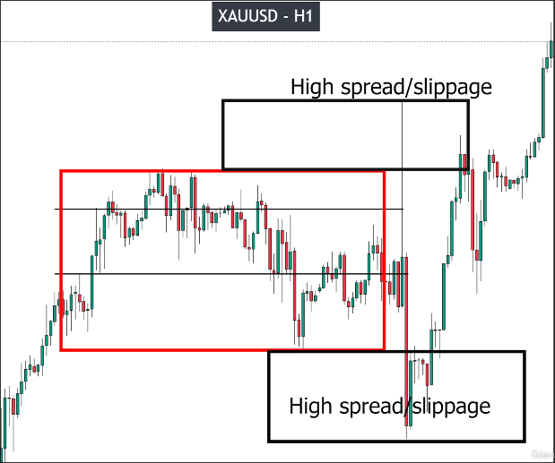

# What you should do with a RANGE: Trading or Skip it

Rules: Skip trading RANGE and wait for a VALID BREAKOUT always!

No one wants the range to continue, especially big boys and hedge funds, because they can profit from price increases and buy cheaply when prices fall. Therefore, they will try to break through the range several times.

When these attempts form fake breakouts, the range will expand and noise will increase, making the market even more unstable.

Some traders see a clear high and low in a large range and may want to short at the high and long at the low. However, this kind of operation is very dangerous because even if it is a fake breakout, the power can be very strong, causing the price to break through the range quickly and then immediately retract. At this time, trades that enter the market, even with stop loss set, can incur significant losses due to the large power causing large spreads/slippage.

Therefore, we must wait for a valid breakout before entering the market, and absolutely avoid trading during a range, especially when the cost is very high. Trading within a range is a very high-risk behavior.

