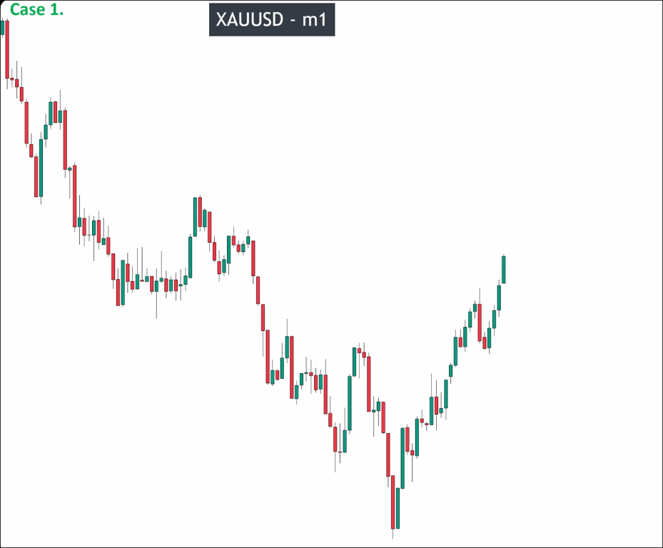

# Assigment 1: XAUUSD Market structure_detail explanation

The chart shows a clear downward trend followed by an upward trend returning to a price position close to halfway back to the previous level.

We must start analyzing from the downward trend, first using the breakout standard to confirm the first pulse wave, then using the pullback standard to confirm the second pulse wave and draw the lowest low. Then, using the breakout standard to determine if the lowest low has been effectively broken out, we can confirm the second pulse wave and generate the first key level. By repeating this process, we can analyze and determine the final key level position of the downtrend.

It is important to confirm the final key level position of the downtrend, as it is necessary to know it in order to determine whether the subsequent price increase has truly caused a trend reversal.

After confirming the pullback, we only care about the breakout of the lowest low. We don't need to worry about the process in between. There are countless candles on the chart, but we only need to analyze the important things.

The use of the "closed inside candle" rule to determine a range does not need to be strictly followed. This will result in a lot of ranges on the chart. It is only meaningful to use this rule to determine a range when there is a clear battle between buyers and sellers. However, pullback standard failed and breakout standard failed will ALWAYS result in a range.

There will only be one key level, so when a new key level is generated, the previous key level should be deleted from the chart. Ranges will also frequently appear and breakout, and once a range is broken out of, it should also be removed from the chart. We should keep the chart clean to avoid unnecessary interference.

