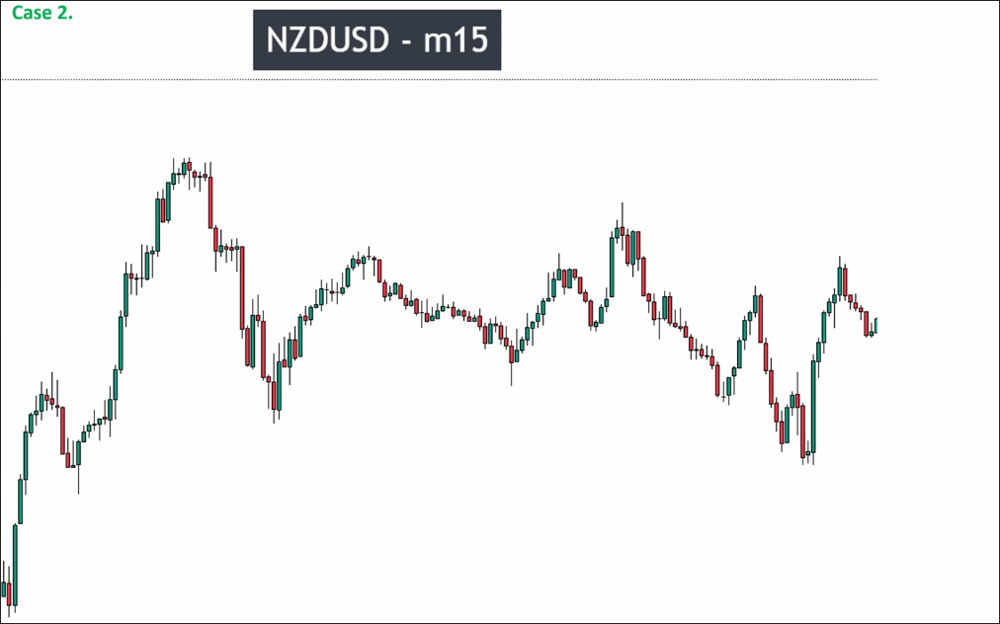

# Assigment 2: NZDUSD Market structure_detail explanation

The chart first shows a strong uptrend, followed by a long period of gradual decline with big noise. It is recommended to start analyzing from the uptrend, rather than analyzing from the highest point to the current price.

We use the last five maru candles to determine whether a candle is big. It must have a length close to the maximum length of the maru candle to be considered a big candle. If it is significantly smaller, it is not considered a big candle.

When judging a pullback or breakout, if the trend behind is very clear, we can directly find a standard pattern to determine whether the pullback or breakout is valid, and do not need to analyze each candlestick from a key position.

When the distance between the subsequent recent high (or low) at key levels is sufficient, a smaller trend may also appear in the middle range. We must also analyze this because the smaller trend can also create key levels. If we enter at the main key level, this smaller key level become a high-risk area, and we must do risk management when price approaches this area.

After the pullback, the range that appears can help us draw key levels (but not confirmed yet). Afterwards, we only need to analyze whether the recent high (or low) has been broken, without paying attention to that range. Because once the recent high (or low) is broken, the range will naturally be broken as well. This can reduce the time spent on analysis.

When analyzing the smaller trends that occur between key levels and recent highs (or lows) of the main trend, failed pullbacks will also create a range. Do not miss this point.
