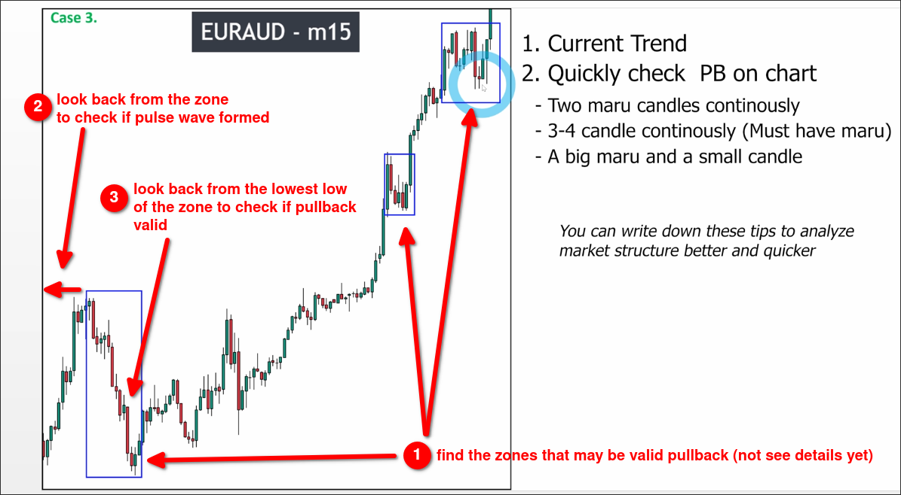

# Assigment 3: EURAUD start to analyze chart QUICKER

我們使用上圖示範如何快速的分析 market structure:

1. First, use the techniques from [[2025-04-05_How-to-analyze-market-structure-QUICKER|How to analyze market structure QUICKER]] to roughly identify areas where there may be a pullback.

2. Look back from the first area and use the breakout standard to identify the pulse wave.

3. Look back from the bottom of the area (if uptrend) and use the pullback standard to identify the pullback wave.

4. If the 2. and 3. confirmed pulse wave and pullback wave, then we can skip the price inside the area and go to analyze the next area directly in the same way.

The above method can save us a lot of time in analyzing market structure, as we do not need to analyze every single candlestick, we just need to analyze in key areas.

Some parts of the range may cause the market trend to be unclear, so the above method may not be applicable. It is necessary to analyze step by step from left to right in order to avoid errors.

Pattern - "Two maru" must see two MARUBOZU candles, and then see if the criteria are met and if price action confirmation can be used. A maru + a doji cannot be judged from the perspective of the second failed candle in the "Two maru" pattern, or you just abuse this pattern.

