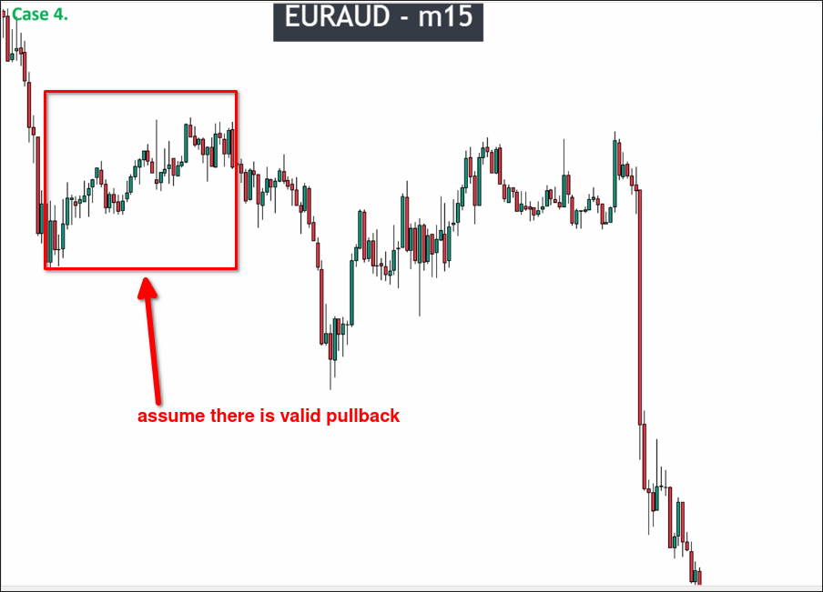

# Assigment 4: EURAUD A note for price action confirmation

The above chart is a 15-minute chart of EURAUD. Using the techniques from [[2025-04-05_How-to-analyze-market-structure-QUICKER|How to analyze market structure QUICKER]], we first assume that a pullback will occur in a certain area.

But this time, the approach is different from [[2025-04-05_Assigment-3:-EURAUD-start-to-analyze-chart-QUICKER|assignment 3: EURAUD start to analyze chart QUICKER]]. We first directly confirm whether the pullback in the area is valid instead of confirming the pulse wave first. Because if the pullback in the area is invalid, it will create a range, and then we must find the position of the breakout range. When we find a valid breakout, it also confirms the pulse wave. Therefore, we should not confirm the pulse wave first, as it may waste time.

The noise in this area is very obvious, there is no consistent power appearing. So we can only analyze candles one by one from left to right. Although this is slower, if we define the wrong key level in order to speed up, we will easily lose money when we enter using this wrong key level.

The final analysis results show that there is no pullback in this area, so it is also impossible to define key levels. This is important because beginners often simply look at the chart without conducting a detailed analysis and randomly define the position of key levels. Entering the market using these key levels will result in losses. We must conduct a detailed analysis to come to a conclusion.

When using the "Two maru" pattern, the candle cannot be too small. It is necessary to compare the size of the candle with the previous five maru candles to determine if the "Two maru" candle is too small. Using a small candle in the "Two maru" pattern to confirm a valid pullback or breakout carries a high risk, which may lead to defining key levels in the wrong position.

