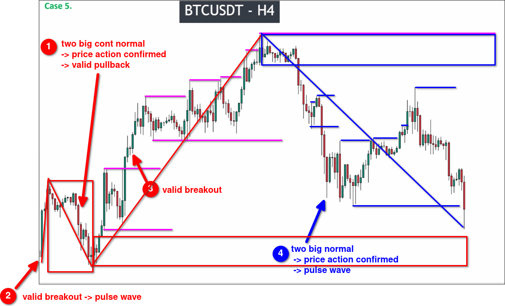

# Assigment 5: Bitcoin chart_A special case of PRICE ACTION confirmation

As you can see, BTC has much noise in the chart, not a easy pair to trade.
Beginners are advised to start with simple products to familiarize themselves with the skills. You can refer to [[2025-04-05_Recommend-forex-for-the-newbie|Recommend forex for the newbie]].

In this chart, the same special case "two large regular candles" appears twice. The rules can be referred to in [[2025-04-04_Three-special-cases-for-pullback-and-breakout|Three special cases for pullback and breakout]].

When analyzing the trend in a pullback, there is no need to consider the range generated in the main trend.

If there is no pullback in the trend, then the key level is the starting point of the trend, so the key level of the opposite trend is near the highest point. After entering the key level of the main trend, we can exit at the key level of the opposite trend.

